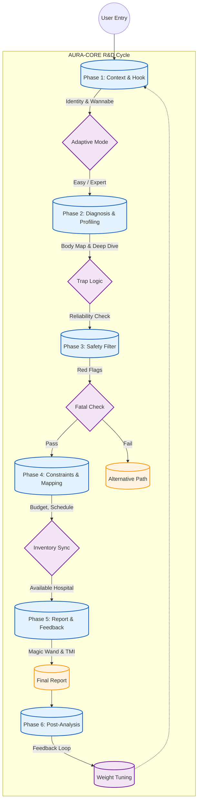

# ALGORITHM_OVERVIEW.md - AURA-CORE 연구 사이클 (V2.0 The Core Philosophy Integration)

**핵심 지침: 아우라 선언문 (V2.0 Final)**
> "이것은 우리의 철학이자, 운영 방식이며, 영혼이다." - Jay

이 문서는 AURA-CORE 시스템의 핵심 원칙과 운영 지침을 정의합니다.

## 1. 아우라 코어의 8대 원칙 (The 8 Pillars of AURA-CORE)

1.  **철학: "막다른 길은 없다 (No Dead Ends)"**
    - **Alternative Path:** 메디컬 시술이 불가능한 경우(임신, 질환 등), 단순히 거절하지 않고 에스테틱, 스파, 홈케어 등 **대안적 회복 경로**를 반드시 제안합니다. 트래픽을 버리지 않고 가치 있게 전환합니다.
2.  **운영: 시각적 입력, 텍스트 처리 (Visual Input, Text Processing)**
    - **Frontend:** 사용자는 이미지 카드, 바디 맵(Body Map)을 터치하여 직관적으로 반응합니다. (피로도 최소화)
    - **Backend:** 모든 시각적 입력은 내부적으로 정교한 텍스트 데이터로 변환되어 분석됩니다. (명확성 및 로직 효율성)
3.  **상담: 게이미피케이션 & 티키타카 (Gamified Interaction)**
    - 단순한 문답이 아닌, **"심리 테스트"**를 하는 듯한 즐거움을 제공합니다.
    - **Feedback Loop:** 사용자의 응답에 대해 "아, 저도 그래요!", "피부 타입이 정말 좋으시네요!"와 같은 **즉각적인 리액션(AI Reaction)**을 제공하여 몰입도를 높입니다.
4.  **설계: 실용적 디자인 (Practical Design)**
    - **Docs = Code.** 읽기 쉬운 문서가 곧 코드 로직을 설명해야 합니다. 문서는 구현의 유일한 진실 공급원(SSOT)입니다.
5.  **신뢰: 1 진단 = 1 병원 + 근거 (1 Diagnosis = 1 Hospital + Why)**
    - **Hero Recommendation:** 선택의 역설을 피하기 위해 단 하나의 최적 병원을 추천합니다.
    - **Transparent Rationale:** 사용자가 납득할 수 있도록 **"왜 이 병원인가?"에 대한 논리적 근거(매칭률, 데이터)**를 투명하게 시각화하여 보여줍니다.
6.  **데이터 자산화: 스마트 아카이빙 (Smart Data Archiving)**
    - **Agent Ready:** 여행사/가족 대리 예약을 위해 `User`(예약자)와 `Client`(환자)를 명확히 구분하여 설계합니다.
    - **Filter & Learn:** 모든 로그를 저장하지 않습니다. **"예약 전환 가능성"이 있는 유의미한 데이터만 선별하여 저장**하고, 이를 AI 학습 재료로 활용합니다.
    - **Trend Sensing:** 재미/캐주얼 용도의 데이터는 **"트렌드 분석(Trend Analysis)"** 목적으로만 단기 활용 후 폐기하여 데이터 오염을 방지합니다.
7.  **품질: BDD 정밀성 (BDD Precision)**
    - *거의 모든 상황*을 테스트합니다. 행동 주도 개발(BDD) 원칙을 적용하여 예외 상황까지 빈틈없이 검증합니다.
8.  **평가: 객관적 평가 (Objective Evaluation)**
    - 품질과 효과를 보장하기 위해 연구 결과를 객관적인 점수로 평가합니다.

## 2. AURA-CORE 평가 기준 (Scoring & Weighting System)

> **목표:** 외국인 환자 특성(안전 > 일정 > 효과 > 비용)을 반영하여 최적의 시술을 도출하는 수학적 기준입니다.

### 2.1. 문항 유형별 가중치 로직 (Logic Types)

이 기준은 **"어떤 질문을 먼저 해야 하는가?(Order)"**와 **"꼭 물어봐야 하는가?(Necessity)"**를 판단하는 핵심 척도입니다.

| 유형 코드 | 명칭 (Name) | 우선순위 (Order) | 필수 여부 (Necessity) | 역할 및 예시 |
| :--- | :--- | :--- | :--- | :--- |
| **[FATAL]** | **절대 금기** | **1순위 (최우선)** | **Must Ask** | **가장 먼저 확인.** 답변에 따라 상담 자체가 불가능하거나 방향이 완전히 바뀜. (예: 임신, 로아큐탄) |
| **[HARD]** | **강력 제한** | **2순위 (초반)** | **Must Ask** | **현실적 제약 확인.** 시술 가능한 범위를 확정 짓기 위해 필수. (예: 출국일, 예산 범위) |
| **[SOFT]** | **추천 가중치** | **3순위 (중반)** | **Conditional** | **진단 및 구체화.** 사용자의 고민에 따라 깊이 있게 물어봄. (예: 피부 타입, 고민 부위) |
| **[BONUS]** | **전환 트리거** | **4순위 (후반)** | **Optional** | **만족도 상승.** 몰라도 되지만 알면 120% 만족을 줄 수 있음. (예: 워너비, TMI) |

### 2.2. 최종 스코어 공식 (Scoring Formula)

$$
Score(T) = (BaseScore + \sum W_{soft} + \sum W_{bonus}) \times I_{fatal} \times I_{hard}
$$

- **$I_{fatal}, I_{hard}$:** 조건 위배 시 0 (추천 제외), 통과 시 1.
- **$BaseScore$:** 시술 자체의 기본 효과 점수.
- **전략:** 안전과 일정([FATAL], [HARD])이 확보된 시술 중에서, 사용자의 니즈([SOFT])와 취향([BONUS])을 가장 잘 만족시키는 시술을 1순위로 제안합니다.

## 3. 연구 및 개발 단계 (Research & Development Phases)

> **프로세스:** 사용자의 입력부터 사후 분석까지 이어지는 **6단계 순환 구조(Cycle)**입니다.

### **Phase 1: Context & Hook (진입 및 유혹)**
*   **목표:** 사용자의 이탈을 막고(Hooking), 초기 반응을 통해 **사용자 수준(Level)**을 파악합니다.
*   **핵심 과제:**
    *   **Adaptive Mode:** 첫 3개 질문의 응답 속도와 패턴을 분석하여 **'Easy Mode(초보)'**와 **'Expert Mode(고수)'**로 문진 난이도를 자동 조절합니다.
    *   **Visual Hook:** 텍스트 대신 이미지 선택지를 우선 노출하여 흥미를 유발합니다.

### **Phase 2: Diagnosis & Profiling (핵심 진단)**
*   **목표:** 의학적 정밀 진단을 수행하되, 데이터의 **신뢰성(Reliability)**을 검증합니다.
*   **핵심 과제:**
    *   **Trap Logic:** 모순된 답변(예: 지성 피부인데 건조함 호소)을 감지하여 재확인 질문을 던지거나 신뢰도 점수를 조정합니다.
    *   **Deep Dive Pack:** 선택된 고민 부위에 맞춰 관련된 심층 질문 세트만 동적으로 로드합니다.

### **Phase 3: Safety Filter (안전망 가동)**
*   **목표:** **[FATAL]** 요소를 감지하여 의료 사고를 예방하고 신뢰를 구축합니다.
*   **핵심 과제:**
    *   **Red Flag 감지:** 임신, 수유, 복용 약물, 알러지, 켈로이드 등 [FATAL] 요소 체크.
    *   **Alternative Path (No Dead Ends):** 시술 불가 판정 시, 단순히 거절하는 것이 아니라 **'회복/관리 프로그램'**이나 **'홈케어 솔루션'**으로 경로를 우회시킵니다.

### **Phase 4: Constraints & Mapping (현실적 매칭)**
*   **목표:** 사용자의 상황과 병원의 현실을 조율하여 **'실현 가능한'** 추천을 합니다.
*   **핵심 과제:**
    *   **Inventory Sync:** 추천된 시술을 수행할 수 있는 장비가 해당 병원에 실제로 있는지 실시간(또는 주기적)으로 확인합니다.
    *   **Inbound Logic:** 출국일(Flight)과 시술 다운타임(Downtime)을 대조하여 비행 안전성을 확보합니다.

### **Phase 5: Report & Feedback (결과 전달)**
*   **목표:** 이성적 근거와 감성적 터치로 **예약 전환(Conversion)**을 유도합니다.
*   **핵심 과제:**
    *   **Transparent Rationale:** "왜 이 시술/병원인가?"에 대한 매칭 근거(Match Score)를 그래프나 수치로 투명하게 보여줍니다.
    *   **Magic Wand Effect:** 사용자가 Phase 1에서 꿈꿨던 'Wannabe' 모습이 어떻게 실현될지 시각적으로 강조합니다.

### **Phase 6: Post-Analysis & Optimization (분석 및 진화)**
*   **목표:** 데이터 기반으로 알고리즘과 UX를 **스스로 진화(Self-Evolving)**시킵니다.
*   **핵심 과제:**
    *   **Funnel Analysis (이탈 분석):** 질문별 이탈률을 추적하여 '죽음의 구간(Death Valley)'을 식별합니다. 특정 질문에서 이탈이 높다면 질문을 삭제하거나 순서를 뒤로 미룹니다.
    *   **Rescue Logic:** 응답 시간이 길어지면(고민 중), "건너뛰어도 돼요!" 팝업을 띄워 이탈을 방어합니다.
    *   **Weight Tuning (가중치 보정):** 실제 예약으로 이어진 추천 조합의 가중치($W$)를 상향 조정하고, 선택받지 못한 조합은 하향 조정합니다.

## 4. 스마트 문진 시퀀스 (Smart Consultation Sequence)

> **규칙:** `+ 질문` / `- 답변` 의 단일 트리 구조.

### **Phase 1: Context & Hook (진입 및 유혹)**

+ **"어떤 분위기의 주인공이 되고 싶나요?"**
  - 물광 피부
  - 동안 얼굴
  - V라인
  - 깨끗한 피부

+ **"혹시 다가오는 특별한 날(D-Day)이 있나요?"**
  - 결혼식·웨딩
  - 중요한 데이트·소개팅
  - 여행·휴가
  - 동창회·모임
  - 면접·미팅
  - 딱히 없음 (평소 관리)

+ **"혹시... 요즘 스트레스 받는 일이 많으신가요?"**
  - 네, 힐링이 필요해요
  - 아니요, 괜찮아요

+ **"이번 시술, 혹시 특별한 이유가 있나요?"**
  - 나를 위한 선물
  - 그냥 관리 차원
  - 특별한 날을 위해

### **Phase 2: Diagnosis & Profiling (핵심 진단)**

+ **"가장 고민되는 부위를 터치해 주세요."**
  - 이마
  - 눈가
  - 볼
  - 코
  - 입가
  - 턱선
  - 목
  - 바디

+ **"평소 본인의 피부 톤은 어느 쪽에 가깝나요?"**
  - Type I (매우 하얀 편 - 항상 붉어짐) #F5E0D8
  - Type II (하얀 편 - 쉽게 붉어짐) #EBC4B2
  - Type III (보통 - 서서히 탐) #D4AA8F
  - Type IV (약간 어두운 편 - 잘 탐) #AC8264
  - Type V (어두운 편 - 매우 잘 탐) #785036
  - Type VI (매우 어두운 편 - 검게 변함) #3E291F
  - 잘 모르겠어요 (평균으로 가정)

+ **"세안하고 나서 피부가 당기는 느낌이 드나요?"**
  - 네
  - 아니요
  - 잘 모름

+ **"오후 3시쯤 되면 이마나 코에 기름이 올라오나요?"**
  - 네
  - 아니요
  - 잘 모름

+ **"거울을 봤을 때, 모공이 눈에 띄게 보이나요?"**
  - 코 주변만
  - 나비존(볼 안쪽)까지
  - 안 보임

+ **"여드름이 난다면, 주로 어떤 형태인가요?"**
  - 좁쌀
  - 붉고 아픈 것
  - 노랗게 곪는 것
  - 안 남

+ **"피부 톤이 전체적으로 칙칙해 보이나요?"**
  - 네
  - 아니요

+ **"다크서클이 있다면, 어떤 색에 가깝나요?"**
  - 푸른빛 (혈관형)
  - 갈색빛 (색소형)
  - 검은 그림자 (구조형)
  - 없음

+ **"온도 차이가 심하거나 술을 마시면 얼굴이 쉽게 빨개지나요?"**
  - 네
  - 아니요

+ **"볼이나 코 주변에 실핏줄이 비쳐 보이나요?"**
  - 네
  - 아니요

+ **"피부가 남들보다 얇다고 느끼시나요?"**
  - 네
  - 아니요

+ **"웃을 때 눈가에 주름이 많이 잡히나요?"**
  - 네
  - 아니요

+ **"무표정일 때도 팔자 주름이 선명한가요?"**
  - 네
  - 아니요

+ **"볼을 꼬집었다 놓으면 탄력이 금방 돌아오나요?"**
  - 네
  - 아니요

+ **"예전보다 턱선이 무너지고 이중턱이 생긴 것 같나요?"**
  - 네
  - 아니요

+ **"볼살이 꺼져서 피곤해 보인다는 말을 듣나요?"**
  - 네
  - 아니요

+ **"사각턱 근육이 발달했거나, 잘 때 이를 가시나요?"**
  - 네
  - 아니요

+ **"등이나 가슴에도 여드름이 나나요?"**
  - 네
  - 아니요

+ **"다리가 자주 붓거나 무거운 느낌이 드나요?"**
  - 네
  - 아니요

+ **"어깨나 목(승모근)이 자주 뭉치나요?"**
  - 네
  - 아니요

+ **"이마는 번들거리는데, 속은 당기는 느낌(속건조)이 드나요?"**
  - 네
  - 아니요

+ **"혹시 평소에 얼굴에 손을 자주 대거나 뜯는 습관이 있나요?"**
  - 네
  - 아니요

+ **"이 고민은 언제부터 시작되었나요?"**
  - 최근에 갑자기
  - 몇 달 전부터
  - 어릴 때부터

### **Phase 3: Safety Filter (안전망 가동)**

+ **"안전한 시술 추천을 위해, 생물학적 성별을 알려주세요."**
  - 여성
    + **"혹시 현재 임신 중이신가요?"**
      - Yes
      - No
      - 모르겠음
    + **"현재 모유 수유 중이신가요?"**
      - Yes
      - No
    + **"6개월 내에 임신 계획이 있으신가요?"**
      - Yes
      - No
  - 남성
  - 선택 안 함

+ **"과거에 비슷한 시술을 받아보신 적이 있나요?"**
  - 처음이에요
  - 경험 있어요 (만족)
  - 경험 있어요 (불만족)
    + **"만약 경험이 있다면, 어떤 시술이었나요?"**
      - 보톡스
      - 필러
      - 레이저
      - 스킨부스터
    + **"혹시 과거 시술 후 부작용을 겪으신 적이 있나요?"**
      - 화상
      - 색소침착
      - 볼패임
      - 없음

+ **"현재 복용 중인 약이 있나요?"**
  - 로아큐탄 (여드름약)
  - 아스피린/항응고제
  - 항생제
  - 없음

+ **"앓고 계신 기저 질환이 있나요?"**
  - 당뇨
  - 고혈압
  - 갑상선 질환
  - 없음

+ **"알레르기가 있나요?"**
  - 리도카인 (마취제)
  - 금속
  - 라텍스
  - 항생제
  - 없음

+ **"상처가 나면 켈로이드처럼 튀어오르는 편인가요?"**
  - 네
  - 아니요

+ **"얼굴에 금속 보형물이나 임플란트가 있나요?"**
  - 네
  - 아니요

+ **"심장 박동기(Pacemaker)를 시술하셨나요?"**
  - 네
  - 아니요

+ **"폐소공포증(밀실 공포)이 있으신가요?"**
  - 네
  - 아니요

+ **"최근 6개월 내에 전신 마취 수술을 받으셨나요?"**
  - 네
  - 아니요

### **Phase 4: Constraints & Mapping (현실적 매칭)**

+ **"티 안 나게 예뻐지는 것과, 확실하게 달라지는 것 중 무엇을 선호하세요?"**
  - 자연스럽게
  - 드라마틱하게

+ **"이 시술은 누구를 위한 건가요?"**
  - 나 자신
  - 가족이나 친구 (선물)

+ **"한국에는 얼마나 머무르시나요?"**
  - 입국일 / 출국일 입력

+ **"귀국 후 실밥 제거를 위해 병원에 갈 수 있으신가요?"**
  - 네
  - 아니요

+ **"시술 후 멍이나 붓기가 며칠까지 있어도 괜찮나요?"**
  - 당일 회복 원함
  - 2-3일 정도
  - 일주일
  - 상관없음

+ **"시술 후 멍이나 붓기가 있으면 절대 안 되는 중요한 일정이 있나요?"**
  - 네
  - 아니요

+ **"이번 시술에 생각하고 계신 예산 범위는 어느 정도인가요?"**
  - 가성비 (실속형)
  - 프리미엄 (고급형)
  - 상관없음

+ **"아픔은 얼마나 참을 수 있나요?"**
  - 주사 절대 싫음
  - 마취크림이면 OK
  - 예뻐진다면 참음

+ **"부작용에 대해서는 얼마나 걱정되시나요?"**
  - 절대 안 돼요
  - 효과가 좋다면 감수할 수 있어요

+ **"혹시 텍스 리펀(Tax Refund)이 필요하신가요?"**
  - 네
  - 아니요

+ **"상담 시 통역 서비스가 필요하신가요?"**
  - 네
  - 아니요

+ **"결정할 때 조언해 줄 동행인이 함께 오시나요?"**
  - 네
  - 아니요

### **Phase 5: Report & Feedback (결과 전달)**

+ **"더 완벽한 결과를 위해, 생활 습관도 살짝 체크해 드릴까요?"**
  - 네
    + **"평소 잠은 푹 주무시나요?"**
      - 잘 잠
      - 보통
      - 불면증 있음
    + **"하루에 물은 얼마나 드세요?"**
      - 1L 미만
      - 1L~2L
      - 2L 이상
    + **"단 음식이나 밀가루 음식을 즐겨 드시나요?"**
      - 네
      - 아니요
    + **"술이나 담배를 하시나요?"**
      - 네
      - 아니요
    + **"평소 베개 커버는 자주 세탁하시나요?"**
      - 네
      - 아니요
    + **"스마트폰이 얼굴에 자주 닿는 편인가요?"**
      - 네
      - 아니요
    + **"선크림은 매일 챙겨 바르시나요?"**
      - 네
      - 아니요
    + **"화장은 진하게 하는 편인가요, 연하게 하는 편인가요?"**
      - 진하게
      - 연하게
      - 안 함
    + **"평소 셀카를 찍을 때 선호하는 각도가 있나요?"**
      - 왼쪽
      - 오른쪽
      - 정면
    + **"사진 보정 어플로 가장 많이 고치는 부위는 어디인가요?"**
      - 눈
      - 코
      - 턱선
      - 피부
    + **"직업상 외모가 중요한 편인가요?"**
      - 네
      - 아니요
  - 아니요

+ **"마지막 질문! 지금 당장 마법처럼 딱 한 가지 소원을 들어준다면?"**
  - 코 모공 싹 지우기
  - 턱선 쫙 올리기
  - 다크서클 없애기
  - 피부 하얗게 만들기
  - 주름 다 펴기

## 5. 실행 가이드 (Implementation Guide)

> **Objective:** 기획된 내용을 실제 서비스로 구현할 때 필요한 구체적인 지침입니다.

### 5.1. 다국어 뉘앙스 가이드 (Global Nuance)
*   **Context over Literal:** 직역보다는 **문화적 맥락**을 고려한 의역을 우선합니다.
*   **Examples:**
    *   **"동안 (Baby Face)"** -> *English:* "Youthful Glow" or "Rejuvenation" (Not just 'Baby Face')
    *   **"티 안 나게"** -> *English:* "Subtle Enhancement" or "Natural Look"
    *   **"화끈거림"** -> *English:* "Burning sensation" vs "Hot flush" (구분 필요)

### 5.2. 시각적 인터페이스 가이드 (Visual Interface)
*   **Text < Visual:** 텍스트 선택지보다는 **이미지/아이콘/슬라이더**를 적극 활용합니다.
*   **Guidelines:**
    *   **Body Map:** 텍스트 리스트 대신, 터치 가능한 3D 인체 모델이나 일러스트 사용.
    *   **Pain Scale:** 숫자(1-10) 대신 표정 이모지(😭-😐-😎) 슬라이더 사용.
    *   **Checklist:** '해당 없음' 버튼을 가장 크고 눈에 띄게 배치하여 이탈 방지.

### 5.3. 피로도 관리 시스템 (Fatigue Management)
*   **Dynamic Skipping:** 사용자의 응답 패턴을 분석하여 불필요한 질문을 자동 생략합니다.
    *   *Rule:* Phase 1~2에서 응답 시간이 매우 짧거나(건성), '상관없음'을 3회 이상 선택 시 -> **Phase 5 (TMI) 전체 스킵.**
*   **Progress Indicator:** "거의 다 왔어요!", "마지막 한 단계!" 등의 문구로 진행 상황을 명확히 보여줍니다.
*   **Save & Resume:** 문진 중 이탈하더라도, 다음에 접속 시 이어서 진행할 수 있도록 상태를 자동 저장합니다.
