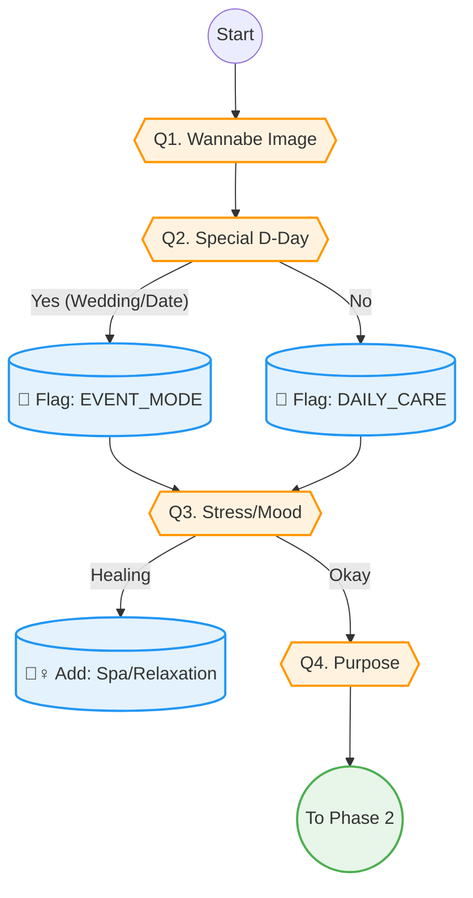

# Phase 1: Context & Hook (진입 및 유혹)

> **Objective:** 사용자 기본 컨텍스트 설정 및 흥미 유발 (Hooking).
> **Philosophy:** **"Fantasy First" (꿈을 먼저 묻다).** 딱딱한 신원 확인보다 설레는 질문으로 시작합니다.
> **Principle:** **Visual Input (시각적 자극).** 텍스트보다는 이미지와 분위기로 소통합니다.
> **Output:** `WannabeGoal`, `EventDDay`, `Mood`, `VisitPurpose`.
> **Version:** V2.1 (Tree Structure & Flow Update)

## 1. 스마트 문진 시퀀스 (Question Tree)

> **규칙:** `+` (질문/화면), `-` (선택지/답변)

+ **"어떤 분위기의 주인공이 되고 싶나요?"** (워너비 이미지)
  - 물광 피부
  - 동안 얼굴
  - V라인
  - 깨끗한 피부

+ **"혹시 다가오는 특별한 날(D-Day)이 있나요?"** (강력한 동기 부여)
  - 결혼식·웨딩 👰‍♀️
  - 중요한 데이트·소개팅 💖
  - 여행·휴가 ✈️
  - 동창회·모임 🥂
  - 면접·미팅 💼
  - 딱히 없음 (평소 관리)

+ **"혹시... 요즘 스트레스 받는 일이 많으신가요?"** (기분 전환)
  - 네, 힐링이 필요해요
  - 아니요, 괜찮아요

+ **"이번 시술, 혹시 특별한 이유가 있나요?"** (보복 소비 성향)
  - 나를 위한 선물
  - 그냥 관리 차원
  - 특별한 날을 위해

## 2. 로직 순서도 (Logic Flow)

## 3. 핵심 포인트
*   **성별/나이 질문 삭제:** Phase 3(Safety)로 이동하여 진입 장벽을 제거했습니다.
*   **D-Day 전진 배치:** 시술 목적을 명확히 하여(결혼, 여행 등) 이후 추천의 정확도를 높입니다.
