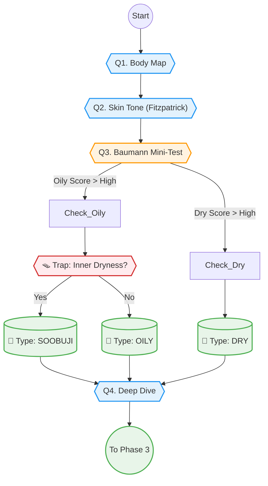

# Phase 2: Diagnosis & Profiling (핵심 진단)

> **Objective:** 사용자의 피부 상태를 과학적이고 정밀하게 진단합니다.
> **Philosophy:** **"Trap & Verify" (교차 검증).** 사용자의 주관적 답변을 객관적 데이터로 보정합니다.
> **Key Logic:** `Baumann Skin Type`, `Fitzpatrick Skin Tone`, `Trap Logic`.
> **Version:** V2.1 (Baumann & Trap Integration)

## 1. 스마트 문진 시퀀스 (Question Tree)

+ **"가장 고민되는 부위를 터치해 주세요."** (Body Map)
  - 이마 / 눈가 / 볼 / 코 / 입가 / 턱선 / 목 / 바디

+ **"평소 본인의 피부 톤은 어느 쪽에 가깝나요?"** (Fitzpatrick Scale)
  - Type I (매우 하얀 편 - 항상 붉어짐) #F5E0D8
  - Type II (하얀 편 - 쉽게 붉어짐) #EBC4B2
  - Type III (보통 - 서서히 탐) #D4AA8F
  - Type IV (약간 어두운 편 - 잘 탐) #AC8264
  - Type V (어두운 편 - 매우 잘 탐) #785036
  - Type VI (매우 어두운 편 - 검게 변함) #3E291F
  - 잘 모르겠어요 (평균으로 가정)

+ **"정확한 피부 타입 분석(MBTI)을 위해 몇 가지만 더 여쭤볼게요."** (Baumann Logic)
  - *[O/D: 오일 지수]*
    - **"세안 후 아무것도 안 바르면 피부가 어떤가요?"** (당김 / 편안 / 번들거림)
    - **"오후 3시, 이마와 코(T존) 상태는?"** (기름종이 필수 / 번들거림 / 뽀송함)
  - *[S/R: 민감 지수]*
    - **"화장품을 바꾸거나 컨디션이 안 좋으면 바로 트러블이 올라오나요?"** (자주 그럼 / 가끔 / 거의 없음)
    - **"얼굴이 붉어지거나 열감이 느껴지나요?"** (자주 / 가끔 / 없음)
  - *[P/N: 색소 지수]*
    - **"여드름이 낫고 나면 갈색/검은색 자국이 남나요?"** (오래 감 / 금방 사라짐 / 안 남음)
    - **"자외선을 받으면 어떻게 되나요?"** (검게 탐 / 붉어지다 검게 탐 / 붉어지기만 함)
  - *[W/T: 주름/탄력 지수]*
    - **"눈가나 입가에 잔주름이 눈에 띄나요?"** (네 / 아니요)
    - **"예전보다 피부 탄력이 떨어져서 처지는 느낌이 드나요?"** (네 / 아니요)

+ **"잠깐! 더 정확한 분석을 위해 확인해 볼게요."** (Trap Logic - 교차 검증)
  - **"이마는 번들거리는데, 속은 당기는 느낌(속건조)이 드나요?"** (수부지 검증)
    - 네, 맞아요
    - 아니요
  - **"혹시 평소에 얼굴에 손을 자주 대거나 뜯는 습관이 있나요?"** (트러블 원인 검증)
    - 네, 무의식적으로 만져요
    - 아니요

+ **"어떤 점이 마음에 안 드시나요?"** (Symptom Detail - Deep Dive)
  - *[피부결/톤]*
    - 세안하고 나서 피부가 당기는 느낌이 드나요?
    - 오후 3시쯤 되면 이마나 코에 기름이 올라오나요?
    - 거울을 봤을 때, 모공이 눈에 띄게 보이나요? (코 주변만 / 나비존까지 / 안 보임)
    - 여드름이 난다면, 주로 어떤 형태인가요? (좁쌀 / 붉고 아픈 것 / 곪는 것 / 안 남)
    - 피부 톤이 전체적으로 칙칙해 보이나요?
    - 다크서클이 있다면, 어떤 색에 가깝나요?
    - 온도 차이가 심하거나 술을 마시면 얼굴이 쉽게 빨개지나요?
    - 볼이나 코 주변에 실핏줄이 비쳐 보이나요?
    - 피부가 남들보다 얇다고 느끼시나요?
  - *[탄력/주름]*
    - 웃을 때 눈가에 주름이 많이 잡히나요?
    - 무표정일 때도 팔자 주름이 선명한가요?
    - 볼을 꼬집었다 놓으면 탄력이 금방 돌아오나요?
    - 예전보다 턱선이 무너지고 이중턱이 생긴 것 같나요?
    - 볼살이 꺼져서 피곤해 보인다는 말을 듣나요?
  - *[윤곽/이목구비]*
    - 사각턱 근육이 발달했거나, 잘 때 이를 가시나요?
  - *[바디/체형]*
    - 등이나 가슴에도 여드름이 나나요?
    - 다리가 자주 붓거나 무거운 느낌이 드나요?
    - 어깨나 목(승모근)이 자주 뭉치나요?

+ **"이 고민은 언제부터 시작되었나요?"** (Timeline)
  - 최근에 갑자기 (급성)
  - 몇 달 전부터 (만성)
  - 어릴 때부터 (선천성)

## 2. 진단 로직 순서도 (Diagnosis Flow)

