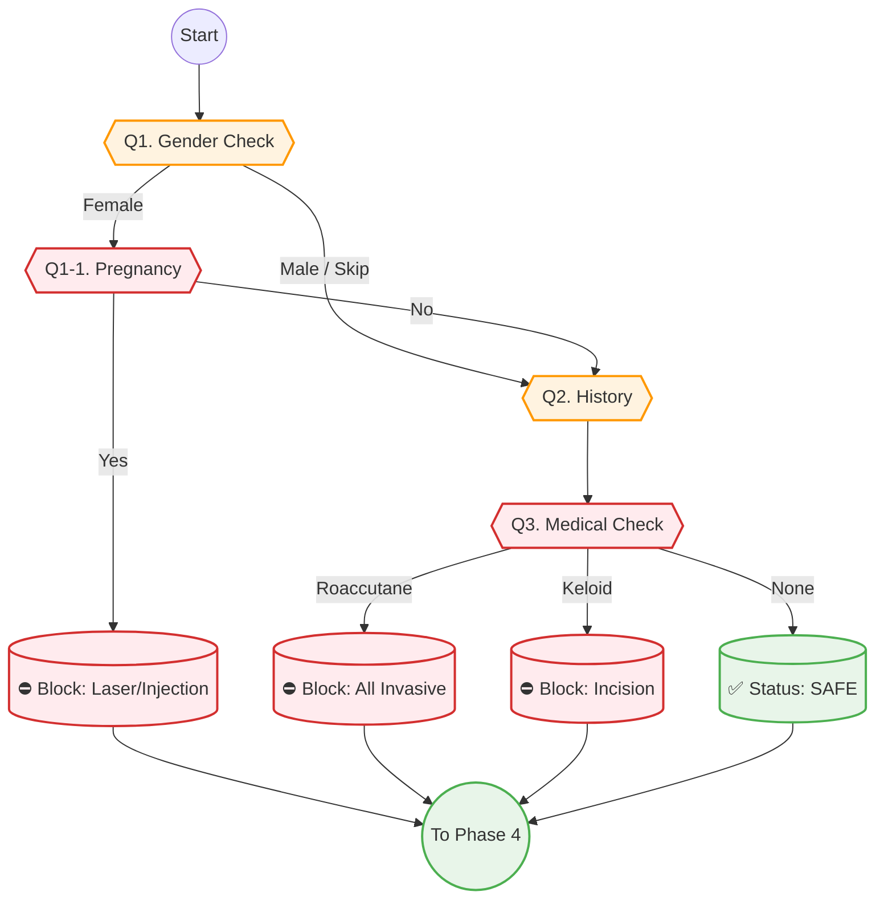

# Phase 3: Safety Filter (안전망 가동)

> **Objective:** [FATAL] 요소를 필터링하여 의료 사고를 예방합니다.
> **Philosophy:** **"Safety as a Service" (안전도 서비스다).** 귀찮은 절차가 아닌, 사용자를 보호하는 과정으로 인식시킵니다.
> **Key Logic:** `Gender Logic`, `Pregnancy Check`, `Medical Contraindications`.
> **Version:** V2.1 (Safety Check & Gender Logic)

## 1. 스마트 문진 시퀀스 (Question Tree)

+ **"안전한 시술 추천을 위해, 생물학적 성별을 알려주세요."**
  - 여성
    + **"혹시 현재 임신 중이신가요?"**
      - Yes
      - No
      - 모르겠음
    + **"현재 모유 수유 중이신가요?"**
      - Yes
      - No
    + **"6개월 내에 임신 계획이 있으신가요?"**
      - Yes
      - No
  - 남성
  - 선택 안 함 (안전 질문 Skip -> 예약 시 확인)

+ **"과거에 비슷한 시술을 받아보신 적이 있나요?"**
  - 처음이에요
  - 경험 있어요 (만족)
  - 경험 있어요 (불만족)
    + **"만약 경험이 있다면, 어떤 시술이었나요?"**
      - 보톡스 / 필러 / 레이저 / 스킨부스터
    + **"혹시 과거 시술 후 부작용을 겪으신 적이 있나요?"**
      - 화상 / 색소침착 / 볼패임 / 없음

+ **"안전을 위해 확인이 필요한 항목이 있나요?"** (체크리스트 - 다중 선택)
  - 현재 복용 중인 약 (로아큐탄, 아스피린, 항생제 등)
  - 기저 질환 (당뇨, 고혈압, 갑상선 질환 등)
  - 알레르기 (리도카인 마취제, 금속, 라텍스 등)
  - 상처가 나면 켈로이드처럼 튀어오르는 편인가요?
  - 얼굴에 금속 보형물이나 임플란트가 있나요?
  - 심장 박동기(Pacemaker)를 시술하셨나요?
  - 폐소공포증(밀실 공포)이 있으신가요?
  - 최근 6개월 내에 전신 마취 수술을 받으셨나요?
  - **해당 없음 (None)**

## 2. 안전 로직 순서도 (Safety Flow)

