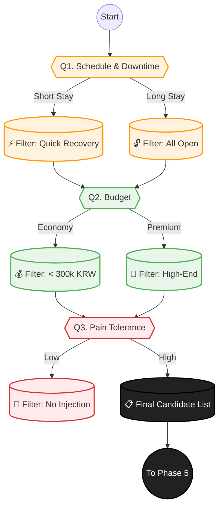

# Phase 4: Constraints & Mapping (현실적 매칭)

> **Objective:** 사용자의 현실적 제약(시간, 돈, 고통)을 고려하여 최적의 시술을 매칭합니다.
> **Philosophy:** **"The Reality Sandwich."** 꿈(Phase 1)과 진단(Phase 2) 사이에 현실(비용/고통)을 끼워 넣어 의사결정을 돕습니다.
> **Key Logic:** `Downtime Filter`, `Budget Matching`, `Pain Tolerance`.
> **Version:** V2.1 (Downtime & Reality Check)

## 1. 스마트 문진 시퀀스 (Question Tree)

+ **"티 안 나게 예뻐지는 것과, 확실하게 달라지는 것 중 무엇을 선호하세요?"**
  - 자연스럽게 (Subtle)
  - 드라마틱하게 (Dramatic)

+ **"이 시술은 누구를 위한 건가요?"**
  - 나 자신
  - 가족이나 친구 (선물)

+ **"한국에는 얼마나 머무르시나요?"** (Inbound Logic)
  - 입국일 / 출국일 입력

+ **"귀국 후 실밥 제거를 위해 병원에 갈 수 있으신가요?"**
  - 네
  - 아니요

+ **"시술 후 멍이나 붓기가 며칠까지 있어도 괜찮나요?"** (최대 허용 다운타임)
  - 당일 회복 원함 (No Downtime)
  - 2-3일 정도 (Short)
  - 일주일 (Medium)
  - 상관없음 (Long OK)

+ **"시술 후 멍이나 붓기가 있으면 절대 안 되는 중요한 일정이 있나요?"** (D-Day 체크)
  - 네
  - 아니요

+ **"이번 시술에 생각하고 계신 예산 범위는 어느 정도인가요?"**
  - 가성비 (실속형)
  - 프리미엄 (고급형)
  - 상관없음

+ **"아픔은 얼마나 참을 수 있나요?"**
  - 주사 절대 싫음 (무통/수면 선호)
  - 마취크림이면 OK
  - 예뻐진다면 참음

+ **"부작용에 대해서는 얼마나 걱정되시나요?"** (위험 감수)
  - 절대 안 돼요 (안전 제일)
  - 효과가 좋다면 감수할 수 있어요

+ **"혹시 텍스 리펀(Tax Refund)이 필요하신가요?"**
  - 네
  - 아니요

+ **"상담 시 통역 서비스가 필요하신가요?"**
  - 네
  - 아니요

+ **"결정할 때 조언해 줄 동행인이 함께 오시나요?"**
  - 네 (친구/가족/연인)
  - 아니요 (혼자)

## 2. 매칭 로직 순서도 (Matching Flow)

