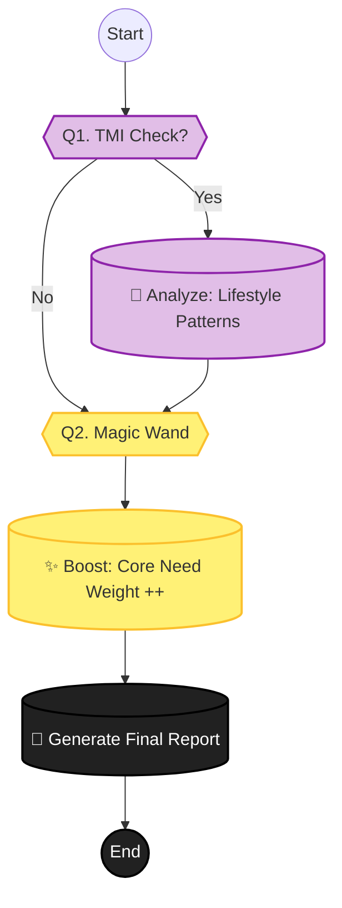

# Phase 5: Report & Feedback (결과 전달)

> **Objective:** 사용자에게 최종 진단 리포트를 제공하고, 추가 정보(TMI)를 통해 정확도를 높입니다.
> **Philosophy:** **"Magic Wand Effect."** 마지막 한 가지 소원을 들어준다는 컨셉으로 사용자의 핵심 니즈를 재확인합니다.
> **Key Logic:** `TMI Analysis`, `Final Scoring`, `Report Generation`.
> **Version:** V2.1 (TMI & Magic Wand)

## 1. 스마트 문진 시퀀스 (Question Tree)

+ **"더 완벽한 결과를 위해, 생활 습관도 살짝 체크해 드릴까요?"** (선택)
  - 네 (TMI 진행)
    + **"평소 잠은 푹 주무시나요?"** (수면 시간 및 질)
      - 잘 잠
      - 보통
      - 불면증 있음
    + **"하루에 물은 얼마나 드세요?"**
      - 1L 미만
      - 1L~2L
      - 2L 이상
    + **"단 음식이나 밀가루 음식을 즐겨 드시나요?"**
      - 네
      - 아니요
    + **"술이나 담배를 하시나요?"**
      - 네
      - 아니요
    + **"평소 베개 커버는 자주 세탁하시나요?"**
      - 네
      - 아니요
    + **"스마트폰이 얼굴에 자주 닿는 편인가요?"**
      - 네
      - 아니요
    + **"선크림은 매일 챙겨 바르시나요?"**
      - 네
      - 아니요
    + **"화장은 진하게 하는 편인가요, 연하게 하는 편인가요?"**
      - 진하게
      - 연하게
      - 안 함
    + **"평소 셀카를 찍을 때 선호하는 각도가 있나요?"**
      - 왼쪽
      - 오른쪽
      - 정면
    + **"사진 보정 어플로 가장 많이 고치는 부위는 어디인가요?"**
      - 눈
      - 코
      - 턱선
      - 피부
    + **"직업상 외모가 중요한 편인가요?"**
      - 네
      - 아니요
  - 아니요 (바로 결과 보기)

+ **"마지막 질문! 지금 당장 마법처럼 딱 한 가지 소원을 들어준다면?"** (Magic Wand)
  - (자유 입력 또는 키워드 선택)
  - 예: 코 모공 싹 지우기, 턱선 쫙 올리기, 다크서클 없애기

## 2. 리포트 생성 로직 순서도 (Report Flow)

