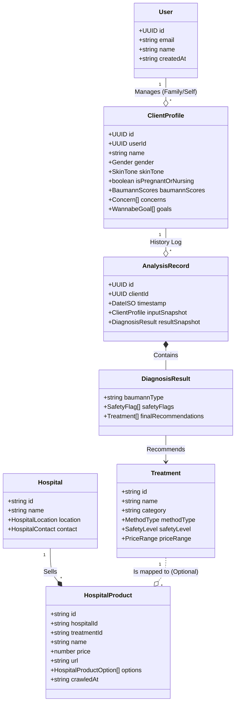

# Aura Core V1.0.0 Data Model

> **Entity Relationship Diagram (ERD)**
> Visualizing the relationships between Identity, Master Data, Inventory, and History.

## Description

### 1. Identity (`User` vs `ClientProfile`)
- **User:** The account holder (login credential). Can manage multiple profiles.
- **ClientProfile:** The actual patient context. Contains biometric data (`SkinTone`, `Gender`) and dynamic preferences (`PainTolerance`).

### 2. Market Data (`Treatment` vs `HospitalProduct`)
- **Treatment:** The abstract concept (e.g., "Ulthera"). Contains **Medical Logic** (`painLevel`, `safetyLevel`).
- **HospitalProduct:** The concrete item sold by a hospital (e.g., "S-Eye Ulthera 300 shots"). Contains **Market Logic** (`price`, `promotion`).
- **Crawler Job:** Fetches `HospitalProduct` and attempts to link it to a `Treatment` via `treatmentId`.

### 3. History (`AnalysisRecord`)
- Stores a snapshot of the `ClientProfile` at the time of analysis to ensure reproducibility even if the user's condition changes later.
