# Mermaid.js Flowchart Standard for Logic Engineering

> **Philosophy:** "Detailed is Integrity."
>
> A flowchart is not just a sketch; it is the **visual source code** of the project. It must be detailed, connected, and strictly aligned with the implementation.

## 1. Core Principles (The 8 Commandments)

1.  **Maximize Detail (Simple is Worst):** Do not abstract away logic. If there is an `if` statement in the code, it must be a diamond node in the chart. Every specific value, threshold, and branch must be visible.
2.  **Unbroken Continuity:** The flow must be continuous from `Start` to `End`. No isolated islands or disconnected subgraphs. Every node must have at least one input and one output (except Start/End).
3.  **Systematic Layering:** Distinctly represent:
    *   **UI/UX:** Questions displayed to the user (Phrasing matters).
    *   **Data:** Variables being saved (e.g., `Flag: isPregnant`).
    *   **Logic:** Internal business rules (Filtering, Scoring).
4.  **Goal-Oriented (Treatment Recommendation):** The flow must visibly converge towards generating specific treatment recommendations.
5.  **Additive Evolution:** Logic steps can be added or modified to improve precision, but never blindly removed to simplify the diagram.
6.  **Code-Chart Parity:** The chart is the spec. `flowchart.mermaid` === `CoreLogic.ts`. A mismatch is a bug.
7.  **Psychological Phrasing:** UI Nodes must contain the actual intent or psychological nuance of the question (e.g., "Are you afraid of pain?" vs "painTolerance").
8.  **Rich Symbology:** Use diverse shapes (Diamond, Cylinder, Rect, Stadium) and styles to differentiate component types instantly.

## 2. Symbol & Style System

Use `classDef` to enforce visual consistency.

| Component | Shape Code | Mermaid Syntax | Color/Style |
| :--- | :--- | :--- | :--- |
| **Start/End** | Circle | `((Start))` | `fill:#263238, color:#fff` |
| **UI Question** | Rectangle | `Q1["❓ Q1. Question Text"]` | `fill:#E3F2FD, stroke:#2196F3` |
| **User Answer** | Rounded | `Ans1("Yes")` | `fill:#FFF3E0, stroke:#FF9800` |
| **Logic/Check** | Diamond | `Check{{"⚙️ Logic"}}` | `fill:#E0F2F1, stroke:#009688` |
| **Variable/Data** | Cylinder | `Var[("💾 SET_VAR")]` | `fill:#F3E5F5, stroke:#8E24AA` |
| **Critical/Risk** | Hexagon | `Risk{{"🛑 RISK_CHECK"}}` | `fill:#FFEBEE, stroke:#D32F2F` |
| **Result/Tx** | Subroutine | `Tx[["✨ Ulthera"]]` | `fill:#212121, color:#fff` |

### Recommended Header
```mermaid
classDef system fill:#263238,stroke:#000,stroke-width:1px,color:#fff;
classDef ui fill:#E3F2FD,stroke:#2196F3,stroke-width:2px,color:#0D47A1;
classDef user fill:#FFF3E0,stroke:#FF9800,stroke-width:2px,color:#E65100;
classDef logic fill:#E0F2F1,stroke:#009688,stroke-width:2px,color:#004D40;
classDef data fill:#F3E5F5,stroke:#8E24AA,stroke-width:2px,color:#4A148C;
classDef risk fill:#FFEBEE,stroke:#D32F2F,stroke-width:2px,color:#B71C1C;
```

## 3. Evaluation Criteria (Scoring Rubric)

When reviewing a Mermaid diagram, assess it against this 100-point scale.

| Category | Weight | Criteria | Perfect Score Example |
| :--- | :--- | :--- | :--- |
| **Detail & Logic** | 30 | Does it show exact thresholds? Are all branches mapped? (Simple = 0pts) | `Check{Age > 30}` instead of `Check{Age}` |
| **Continuity** | 20 | Is there a broken path? Dead ends? | Arrows connect every step seamlessly to the Report/End. |
| **Code Parity** | 20 | Does checking the `.ts` file reveal hidden logic not in the chart? | Variable names in chart match `types.ts` exactly. |
| **Full Context** | 15 | Does it separate UI, Data, and Logic clearly? | UI Node -> User Selection -> Data Cylinder -> Logic Diamond. |
| **Psychology** | 15 | Does the UI text reflect the user's feeling? | "Scared of needles?" instead of just "No Injection". |

## 4. From Chart to Code: The Implementation Guide

This section is for developers. Follow these rules to translate the chart into **perfect TypeScript code**.

### A. Naming Conventions (TypeScript Standard)
*   **Variable/Data Nodes:** Use **CamelCase** (e.g., `isPregnant`, `skinType`). Matches `types.ts` properties.
*   **Logic Nodes:** Use **Function Calls** (e.g., `checkPoreSize()`, `calculateScore()`).
*   **User Answers:** Map to **Enum** or **String Literal** values.

### B. Translation Table

| Mermaid Component | TypeScript Implementation | Example Code |
| :--- | :--- | :--- |
| `Q1["Question"]` | **Input Step** (UI/CLI) | `const answer = await ask("Question?");` |
| `Ans("Yes")` | **Value Assignment** | `user.response = 'Yes';` |
| `Var[("💾 isDry")]` | **State Update** | `state.isDry = true;` |
| `Check{{"⚙️ age > 30"}}` | **Control Flow** (`if/else`) | `if (user.age > 30) { ... }` |
| `Risk{{"🛑 Warning"}}` | **Exception/Filter** | `if (risk) return [];` |

### C. Implementation Example (The "Rosetta Stone")

#### 1. The Mermaid Source

```mermaid
graph TD
Start((Session)) --> Q1["🤔 Q1. When you wash your face..."]:::ui
Q1 -- "It feels tight immediately" --> Ans_Dry("A. Tight / Dry"):::user
Q1 -- "It feels slippery" --> Ans_Oily("B. Slippery / Oily"):::user

Ans_Dry --> Save_D[("💾 Var: isSkinDry = true")]:::data
Ans_Oily --> Save_O[("💾 Var: isSkinDry = false")]:::data

Save_D & Save_O --> Logic_Pore{{"⚙️ checkPoreSize()"}}:::logic
```


#### 2. The TypeScript Result
```typescript
async function runSession(user: ClientProfile) {
  // 1. UI Question (Q1)
  // In a real app, this comes from the frontend, but conceptually:
  const answer = user.washFeeling; // "Tight" or "Slippery"

  // 2. Data Mapping (Ans -> Var)
  if (answer === 'Tight') {
    user.isSkinDry = true; // Save_D
  } else {
    user.isSkinDry = false; // Save_O
  }

  // 3. Logic Execution (Logic_Pore)
  checkPoreSize(user);
}

function checkPoreSize(user: ClientProfile) {
  if (user.isSkinDry) {
    // ... Logic branch
  }
}
```

## 5. Example: The Standard Chart

### ❌ BAD (Simple/Abstract)


### ✅ GOOD (Detailed/Engineered)

```mermaid
graph TD
Start((Session)) --> Q1["🤔 Q1. When you wash your face..."]:::ui
Q1 -- "It feels tight immediately" --> Ans_Dry("A. Tight / Dry"):::user
Q1 -- "It feels slippery" --> Ans_Oily("B. Slippery / Oily"):::user

Ans_Dry --> Save_D[("💾 Var: isSkinDry = true")]:::data
Ans_Oily --> Save_O[("💾 Var: isSkinDry = false")]:::data

Save_D & Save_O --> Logic_Pore{{"⚙️ checkPoreSize()"}}:::logic
Logic_Pore -- "If Dry + Large Pores" --> Aging_Risk{{"👴 Aging Pore Detected"}}:::risk
Logic_Pore -- "If Oily + Large Pores" --> Sebum_Risk{{"🛢️ Sebum Pore Detected"}}:::logic

Aging_Risk --> Rec_1[["✨ Recommend: Ulthera"]]:::system
Sebum_Risk --> Rec_2[["✨ Recommend: Potenza"]]:::system
```

