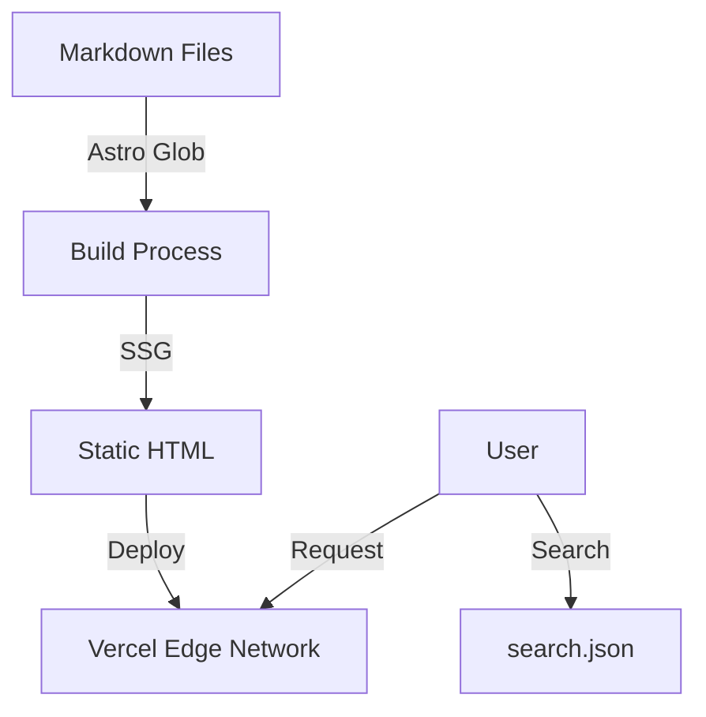

# 🏛️ 소프트웨어 아키텍처 (Software Architecture)

Hello Prompt 프로젝트의 기술적 구조와 설계 원칙을 설명합니다.

## 1. 시스템 개요 (System Overview)

본 프로젝트는 **정적 사이트 생성(SSG, Static Site Generation)** 방식을 채택하여 최고의 성능과 보안성을 보장합니다.

- **Frontend:** Astro (Component-based architecture)
- **Data Source:** Markdown Files (Filesystem-based CMS)
- **Search Engine:** Client-side Indexing (Fuse.js logic)
- **Hosting:** Serverless Edge (Vercel)

## 2. 보안 계층 (Security Layer)

사용자와 데이터를 보호하기 위해 다음과 같은 보안 조치를 적용합니다.

- **HTTPS:** 모든 통신은 SSL/TLS 암호화를 통해 이루어집니다. (Vercel 자동 적용)
- **CSP (Content Security Policy):** 스크립트 실행 소스를 제한하여 XSS 공격을 방지합니다. 외부 스크립트 로드 시 허용된 도메인만 승인합니다.
- **HSTS:** 브라우저가 항상 HTTPS로 접속하도록 강제합니다.

## 3. 데이터 흐름 (Data Flow)

1.  **작성:** 사용자가 `.md` 파일을 작성합니다.
2.  **빌드:** Astro가 빌드 타임에 모든 파일을 읽어 HTML로 변환합니다.
3.  **검색:** 빌드 시점에 제목/태그만 추출하여 `search.json`을 생성하고, 브라우저에서 이를 다운로드하여 검색합니다.

## 4. 디렉토리 구조 및 역할 (Component Hierarchy)

### Layout Layer (`src/layouts/`)
- **`Layout.astro`**: 전역 스타일, 헤더, 푸터, 메타 태그를 관리하는 최상위 래퍼(Wrapper)입니다.

### Page Layer (`src/pages/`)
- **`[...page].astro`**: 메인 페이지. 페이지네이션 로직과 카드 리스트 렌더링을 담당합니다.
- **`posts/*.md`**: 실제 콘텐츠 데이터입니다.
- **`tags/[tag].astro`**: 동적 라우팅을 통해 태그별 아카이브 페이지를 생성합니다.

## 5. 확장성 및 기술 부채 (Scalability)

### 현재 구조 (Phase 1)
- **방식:** `Astro.glob`을 사용한 파일 시스템 접근
- **장점:** 설정이 간편하고 직관적임
- **한계:** 글이 1,000개 이상으로 늘어날 경우 빌드 메모리 부족 우려

### 미래 구조 (Phase 2 - Planned)
- **방식:** **Content Collections (`src/content/`)** 도입
- **이점:**
    - Zod 스키마를 통한 강력한 타입 검증 (Type Safety)
    - 대량의 콘텐츠 처리 시 성능 최적화
    - Markdown 외에 MDX, JSON 등 다양한 소스 지원

## 6. 디자인 패턴 (Design Patterns)
- **Island Architecture:** 검색창 등 상호작용이 필요한 부분만 JS를 로드하여 성능을 극대화합니다.
- **Utility-First CSS:** 별도의 CSS 라이브러리 없이 Scoped CSS를 사용하여 가볍게 유지합니다.

## 7. 데이터 스키마 (Data Schema)

Markdown 파일 상단(Frontmatter)에 정의되는 데이터 구조입니다.

| 필드명 | 타입 | 필수 여부 | 설명 |
| :--- | :--- | :--- | :--- |
| `title` | `string` | ✅ Yes | 글 제목 (H1) |
| `date` | `string` | ✅ Yes | 발행일 (YYYY-MM-DD) |
| `author` | `string` | ✅ Yes | 작성자 (기본값: Zzabbis) |
| `category` | `string` | ✅ Yes | 대분류 (업무 자동화, 개발 등) |
| `tags` | `string[]` | ❌ No | 태그 목록 (검색 및 필터링용) |
| `description` | `string` | ✅ Yes | SEO용 한 줄 요약 |

