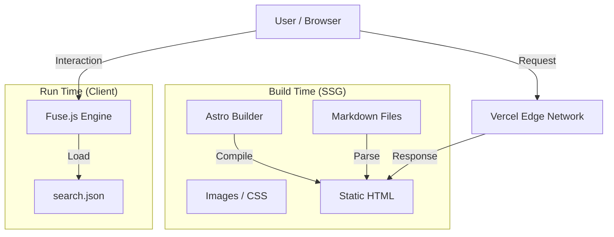

# 🏛️ 소프트웨어 아키텍처 (Software Architecture)

Hello Prompt는 **성능(Performance)**, **단순성(Simplicity)**, **확장성(Scalability)**을 최우선으로 설계되었습니다.
불필요한 복잡도를 제거하고, 콘텐츠 중심의 정적 사이트(Static Site) 모델을 지향합니다.

---

## 1. 기술 스택 (Tech Stack)

| 구분          | 기술                    | 선정 이유                                                             |
| :------------ | :---------------------- | :-------------------------------------------------------------------- |
| **Framework** | **Astro v5**            | 압도적인 빌드 성능, Zero-JS by Default, 콘텐츠 중심 웹사이트에 최적화 |
| **Language**  | **TypeScript**          | 정적 타입 시스템을 통한 안정성 및 유지보수성 확보                     |
| **Styling**   | **CSS Modules**         | 컴포넌트 단위 스코핑, 별도 런타임 라이브러리 불필요                   |
| **Content**   | **Markdown (.md)**      | Git 기반 형상 관리, 개발자 친화적인 집필 환경                         |
| **Search**    | **Fuse.js**             | 서버 없이 클라이언트 사이드에서 가볍고 빠른 퍼지 검색 구현            |
| **Test**      | **Vitest / Playwright** | 빠른 유닛 테스트 및 신뢰성 높은 E2E 테스트                            |
| **Deploy**    | **Vercel**              | 글로벌 엣지 네트워크, 뛰어난 DX (Developer Experience)                |

---

## 2. 시스템 구조 (System Overview)



- **SSG (Static Site Generation):** 모든 페이지는 빌드 타임에 HTML로 생성됩니다. 서버 부하가 없고 보안에 강력합니다.
- **Client-side Search:** 별도의 검색 서버(Elasticsearch 등) 없이, 빌드 시 생성된 `search.json`을 브라우저가 다운로드하여 검색을 수행합니다.
- **No Database:** 별도의 DB가 없습니다. 파일 시스템(Markdown)이 곧 DB입니다.

---

## 3. 디렉토리 구조 (Directory Structure)

```text
src/
├── components/       # 재사용 가능한 UI 컴포넌트 (Button, Card 등)
├── layouts/          # 페이지 레이아웃 (Layout.astro)
├── pages/            # 파일 기반 라우팅
│   ├── [lang]/       # 다국어 지원 라우트
│   │   ├── rss.xml.ts    # 다국어 RSS 피드 생성기
│   │   ├── atom.xml.ts   # 다국어 Atom 피드 생성기
│   │   └── ...
│   ├── api/          # 서버리스/엣지 함수 (OG 이미지 생성 등)
│   └── search.json.ts # 검색 인덱스 생성기
└── utils/            # 비즈니스 로직 및 헬퍼 함수
    ├── dateUtils.ts  # 날짜 처리
    └── postUtils.ts  # 포스트 필터링/정렬 로직
```

---

## 4. 데이터 흐름 (Data Flow)

1. **작성:** 작가가 `src/pages/posts/*.md`에 글을 작성합니다.
2. **빌드:** Astro가 마크다운 파일을 파싱하여 메타데이터와 본문을 추출합니다.
3. **인덱싱:** `search.json.ts`가 모든 글의 정보를 모아 검색 인덱스 파일(`search.json`)을 생성합니다.
4. **렌더링:** `[...page].astro`가 글 목록을 페이지네이션하여 정적 HTML로 만듭니다.
5. **배포:** Vercel이 최종 산출물(`dist/`)을 전 세계 CDN에 배포합니다.

---

## 5. 핵심 전략 (Key Strategies)

### 🌍 국제화 (i18n)

- **URL 전략:** `domain.com/` (한국어), `domain.com/en/` (영어) 등 하위 경로로 분리합니다.
- **콘텐츠 동기화:** 한국어 글이 Source of Truth가 되며, 이를 기준으로 번역본을 관리합니다.

### 🔍 SEO (Search Engine Optimization)

- **Sitemap/RSS:** 자동으로 최신 글을 반영하여 검색 엔진에 핑(Ping)을 보냅니다.
- **Canonical:** 중복 콘텐츠 페널티를 막기 위해 원본 URL을 명시합니다.
- **Semantic HTML:** `<header>`, `<main>`, `<article>`, `<footer>` 등 의미론적 태그를 사용합니다.

### 🧪 테스트 (Testing)

- **Unit:** 유틸리티 함수의 정확성을 검증합니다. (예: 날짜 포맷팅)
- **E2E:** 실제 브라우저 환경에서 메인 페이지 로딩, 검색 기능 작동, 링크 이동 등을 점검합니다.

---

이 문서는 프로젝트의 기술적 뼈대입니다.
구조를 변경할 때는 반드시 이 문서를 함께 업데이트해주세요.
