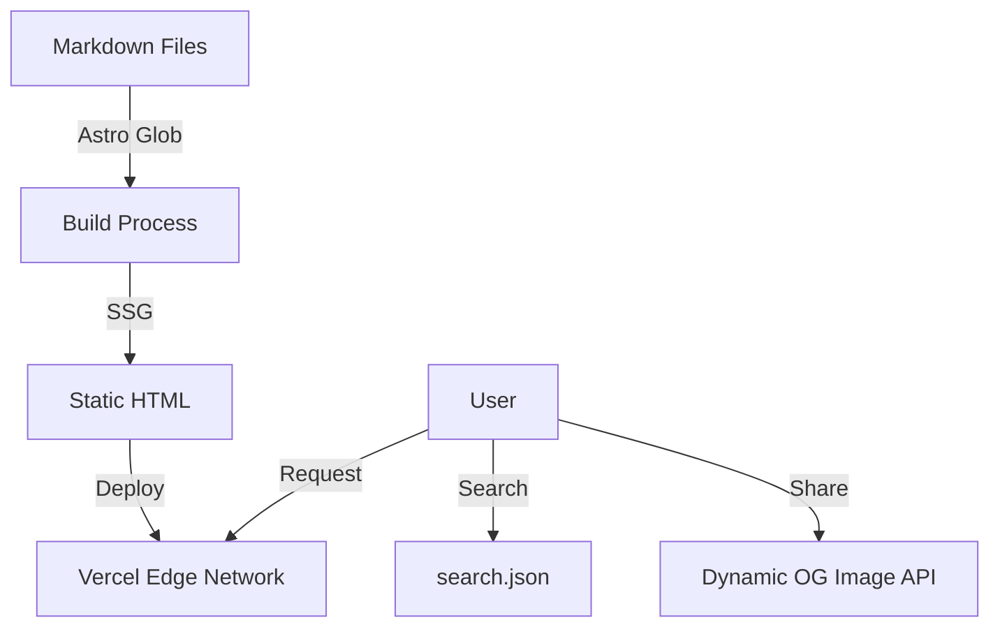

# 🏛️ 소프트웨어 아키텍처 (Software Architecture)

Hello Prompt (Help) 프로젝트의 기술적 구조와 설계 원칙을 설명합니다.

## 1. 시스템 개요 (System Overview)

본 프로젝트는 **정적 사이트 생성(SSG, Static Site Generation)** 방식을 채택하여 최고의 성능과 보안성을 보장합니다.

- **Frontend:** Astro (Component-based architecture)
- **Data Source:** Markdown Files (Filesystem-based CMS)
- **Search Engine:** Client-side Indexing (Fuse.js logic)
- **Hosting:** Serverless Edge (Vercel)

## 2. 보안 계층 (Security Layer)

사용자와 데이터를 보호하기 위해 다음과 같은 보안 조치를 적용합니다.

- **HTTPS:** 모든 통신은 SSL/TLS 암호화를 통해 이루어집니다. (Vercel 자동 적용)
- **CSP (Content Security Policy):** 스크립트 실행 소스를 제한하여 XSS 공격을 방지합니다. 외부 스크립트 로드 시 허용된 도메인만 승인합니다.
- **HSTS:** 브라우저가 항상 HTTPS로 접속하도록 강제합니다.

## 3. 데이터 흐름 (Data Flow)

## 4. 디렉토리 구조 및 역할 (Component Hierarchy)

### Layout Layer (`src/layouts/`)

- **`Layout.astro`**: 전역 스타일, 헤더, 푸터, 메타 태그를 관리하는 최상위 래퍼(Wrapper)입니다.

### Page Layer (`src/pages/`)

- **`[...page].astro`**: 한국어 메인 페이지 (Default). 페이지네이션 로직과 카드 리스트 렌더링을 담당합니다.
- **`posts/*.md`**: 한국어 콘텐츠 데이터 (Source of Truth).
- **`[lang]/[...page].astro`**: 다국어(9개국) 메인 페이지.
- **`[lang]/posts/*.md`**: 다국어 콘텐츠 데이터.
- **`tags/[tag].astro`**: 동적 라우팅을 통해 태그별 아카이브 페이지를 생성합니다.
- **`api/og.ts`**: 동적 OG 이미지를 생성하는 Edge Function입니다.

## 5. 국제화 및 시간 전략 (i18n & Timezone)

**Global First** 원칙에 따라 다국어와 타임존을 체계적으로 관리합니다.

### 🌍 i18n (Internationalization)

- **URL 구조:** `/{lang}/` 프리픽스를 사용하여 언어를 구분합니다. (한국어는 `/` 루트 사용)
- **RSS/Atom:** 언어별 피드를 별도로 생성합니다. (예: `/en/rss.xml`, `/ja/atom.xml`)
- **지원 언어:** KO, EN, DE, ES, FR, IT, JA, PT, RU, ZH (총 10개국)

### ⏰ Timezone Strategy

- **저장 (Storage):** 모든 시간 데이터는 **UTC (ISO 8601)** 기준으로 저장합니다.
- **표시 (Display):** `src/utils/dateUtils.ts`를 통해 사용자의 언어(`lang`)에 맞는 **로컬 타임존**으로 변환하여 표시합니다.
  - `ko` → `Asia/Seoul`
  - `en` → `America/New_York`
  - `de` → `Europe/Berlin`

## 6. SEO 및 소셜 최적화 (SEO Strategy)

검색엔진과 소셜 미디어에서의 노출을 극대화합니다.

### 🔍 Structured Data (JSON-LD)

- **WebSite:** 메인 페이지에 검색창 정보 포함.
- **Article:** 개별 포스트에 제목, 설명, 작성자, 날짜 정보 포함.
- **AggregateRating:** 모든 포스트에 기본 평점(4.8) 마크업 적용.

### 🖼️ Dynamic OG Image

- **엔드포인트:** `/api/og?title=...`
- **기술:** `@vercel/og` (Satori + Resvg)
- **기능:** 글 제목을 파라미터로 받아 실시간으로 썸네일 이미지를 생성하여 `og:image` 태그에 삽입합니다.

## 7. 테스트 전략 (Testing Strategy)

안정적인 서비스를 위해 2단계 테스트를 수행합니다.

### Unit Test (Vitest)

- **대상:** `src/utils/*.ts` (순수 로직)
- **내용:** 날짜 변환 함수(`dateUtils`), 언어 감지 로직 등
- **실행:** `pnpm test`

### E2E Test (Playwright)

- **대상:** 실제 브라우저 환경 (CI/GitHub Actions)
- **주요 시나리오:**
  1.  **SEO 검증:** JSON-LD, OG Image 태그 존재 여부 및 API 응답 확인.
  2.  **i18n 네비게이션:** 로고 클릭 시 현재 언어 홈(`/en/`, `/ja/` 등)으로 정확히 이동하는지 검증.
      - _Note:_ SPA/View Transition 특성상 `page.waitForURL()`을 사용하여 네비게이션 완료를 명시적으로 대기합니다.
  3.  **Feed 검증:** RSS/Atom 피드 URL 접근 시 200 OK 및 XML 포맷 확인.
- **실행:** `pnpm test:e2e`

## 8. 데이터 스키마 (Data Schema)

Markdown 파일 상단(Frontmatter)에 정의되는 데이터 구조입니다.

| 필드명        | 타입       | 필수 여부 | 설명                          |
| :------------ | :--------- | :-------- | :---------------------------- |
| `title`       | `string`   | ✅ Yes    | 글 제목 (H1)                  |
| `date`        | `string`   | ✅ Yes    | 발행일 (UTC ISO 8601)         |
| `updatedDate` | `string`   | ❌ No     | 수정일 (UTC ISO 8601)         |
| `author`      | `string`   | ✅ Yes    | 작성자 (기본값: Zzabbis)      |
| `category`    | `string`   | ✅ Yes    | 대분류 (업무 자동화, 개발 등) |
| `tags`        | `string[]` | ❌ No     | 태그 목록 (검색 및 필터링용)  |
| `description` | `string`   | ✅ Yes    | SEO용 한 줄 요약              |

## 9. 트러블슈팅 (Troubleshooting)

### Shiki 구문 강조 이슈

- **증상:** `vba` 언어 블록 사용 시 `Language 'vba' is not included` 에러 발생.
- **해결:** `vba` 언어 지원을 위해 `vb`를 추가하려 했으나 타입 에러가 발생하여, 마크다운 파일 내의 `vba` 태그를 `text`로 일괄 치환하여 해결함. (하이라이팅 미지원)
