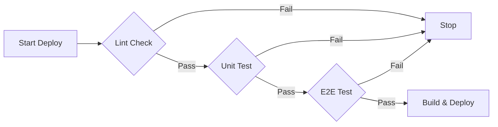

# ⚙️ DevOps & 인프라 가이드

이 프로젝트의 빌드, 테스트, 배포 파이프라인 및 인프라 구성에 대한 문서입니다.

## 1. 배포 파이프라인 (CI/CD Pipeline)

우리는 **"안전하지 않은 코드는 배포하지 않는다"**는 원칙을 따릅니다.
`pnpm run deploy` 명령어를 실행하면 다음 4단계가 순차적으로 진행됩니다.

### 단계별 프로세스

1.  **Lint & Check:** `astro check`로 문법 오류 검사
2.  **Unit Test:** `vitest`로 유틸리티 함수 로직 검증
3.  **E2E Test:** `playwright`로 브라우저 상에서 화면 렌더링 검증
4.  **Build & Deploy:** 위 테스트를 모두 통과하면 `vercel deploy --prod` 실행



## 2. 테스트 전략 (Testing Strategy)

- **Unit Test (Vitest):**
  - 대상: `src/utils.ts` 등 순수 로직
  - 실행: `pnpm test`
- **E2E Test (Playwright):**
  - 대상: 메인 페이지, 검색 기능 등 사용자 시나리오
  - 실행: `pnpm test:e2e`
  - 특징: 실제 Chromium 브라우저를 띄워 테스트함

## 3. 코드 품질 기준 (Code Quality Gate)

우리는 **무결점 코드**를 지향합니다. 다음 기준을 만족하지 못하면 배포 파이프라인이 중단됩니다.

- **Test Coverage:** 단위 테스트 커버리지 **90% 이상** 유지 (Statements, Branches, Functions, Lines)
- **Linting:** `prettier` 및 `astro check` 오류 0건

```bash
# 커버리지 확인 명령어
pnpm test --coverage
```

## 4. 인프라 (Infrastructure)

- **Platform:** Vercel (Serverless / Edge Network)
- **Node Version:** Node.js 18+ (LTS)
- **Package Manager:** pnpm (Strict Mode)

## 5. 모니터링 & 유지보수 (Monitoring)

- **Status Check:** UptimeRobot 등을 이용해 24/7 가동 확인 권장
- **Logs:** Vercel Dashboard의 Runtime Logs 활용
- **Security:** 주기적인 `pnpm audit` 실행 및 패키지 업데이트 (`pnpm update`)

## 6. 트러블 슈팅 (Troubleshooting)

**Q. 배포 중 "Type Error"가 발생해요.**
A. `tsconfig.json`의 `strict` 모드가 켜져 있는지 확인하거나, 코드 내 타입을 명시하십시오.

**Q. E2E 테스트가 실패해요.**
A. 로컬 서버(`pnpm run dev`)가 정상적으로 뜨는지 확인하고, 브라우저 버전이 호환되는지 체크하십시오.

**Q. 커버리지 점수가 낮아서 배포가 안 돼요.**
A. 테스트 코드가 누락된 로직(`src/utils.ts` 등)이 있는지 확인하고, 테스트 케이스를 추가하십시오.
