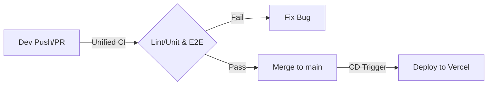

# ⚙️ DevOps & 인프라 가이드

이 프로젝트의 빌드, 테스트, 배포 파이프라인 및 인프라 구성에 대한 문서입니다.

## 1. 배포 파이프라인 (CI/CD Pipeline)

우리는 **Git Flow** 전략을 기반으로 안전한 배포를 지향합니다.

### 🌿 브랜치 전략 (Branch Strategy)

- **`develop` (CI):** 개발 및 통합 브랜치.
  - Push/PR 시: **통합 CI 워크플로우** 실행 (Lint, Unit, E2E 병렬 수행)
  - **Concurrency:** 동일 PR에 새 커밋 푸시 시 이전 테스트 자동 취소 (자원 절약)
  - 목적: 코드 품질 검증
- **`main` (CD):** 배포 브랜치.
  - Push 시: 배포 전용 워크플로우 실행 (**Static Deploy**)
  - 목적: 실제 서비스 운영

### 🚀 배포 프로세스

1.  작업 내용을 `develop` 브랜치에 Push합니다. (GitHub Action: `CI (Lint, Unit & E2E)`)
    - `lint-and-unit`: 정적 분석 및 유닛 테스트
    - `e2e-test`: Playwright E2E 테스트
2.  모든 테스트가 통과되면 `develop` -> `main`으로 Pull Request(PR) 및 Merge를 수행합니다.
3.  `main` 브랜치에 코드가 병합되면 자동으로 배포가 시작됩니다. (GitHub Action: `Deploy to Vercel`)



## 2. 테스트 전략 (Testing Strategy)

- **Unit Test (Vitest):**
  - 대상: `src/utils.ts` 등 순수 로직
  - 실행: `pnpm test`
- **E2E Test (Playwright):**
  - 대상: 메인 페이지, 검색 기능 등 사용자 시나리오
  - 실행: `pnpm test:e2e`
  - 특징: 실제 Chromium 브라우저를 띄워 테스트함

## 3. 코드 품질 기준 (Code Quality Gate)

우리는 **무결점 코드**를 지향합니다. 다음 기준을 만족하지 못하면 배포 파이프라인이 중단됩니다.

- **Test Coverage:** 단위 테스트 커버리지 **90% 이상** 유지 (Statements, Branches, Functions, Lines)
- **Linting:** `prettier` 및 `astro check` 오류 0건

```bash
# 커버리지 확인 명령어
pnpm test --coverage
```

## 4. 인프라 (Infrastructure)

- **Platform:** Vercel (Serverless / Edge Network)
- **Node Version:** Node.js v24.13.0 (LTS)
- **Package Manager:** pnpm (Strict Mode)
- **Deployment Strategy:** Prebuilt Static Deploy
  - GitHub Actions에서 `pnpm run build` 수행 후 `dist/` 폴더만 Vercel로 전송
  - `.vercelignore`로 소스 코드 업로드 차단 (파일 개수 제한 우회)
- **Cache Control:** `vercel.json` 설정
  - HTML (`/(.*)`): `max-age=0, must-revalidate` (항상 최신 확인)
  - Assets (`/images`, `/fonts`): `max-age=31536000, immutable` (장기 캐시)

## 5. 모니터링 & 유지보수 (Monitoring)

- **Status Check:** UptimeRobot 등을 이용해 24/7 가동 확인 권장
- **Logs:** Vercel Dashboard의 Runtime Logs 활용
- **Security:** 주기적인 `pnpm audit` 실행 및 패키지 업데이트 (`pnpm update`)

## 6. 트러블 슈팅 (Troubleshooting)

**Q. 배포 중 "Type Error"가 발생해요.**
A. `tsconfig.json`의 `strict` 모드가 켜져 있는지 확인하거나, 코드 내 타입을 명시하십시오.

**Q. E2E 테스트가 실패해요.**
A. 로컬 서버(`pnpm run dev`)가 정상적으로 뜨는지 확인하고, 브라우저 버전이 호환되는지 체크하십시오.

**Q. 커버리지 점수가 낮아서 배포가 안 돼요.**
A. 테스트 코드가 누락된 로직(`src/utils.ts` 등)이 있는지 확인하고, 테스트 케이스를 추가하십시오.
