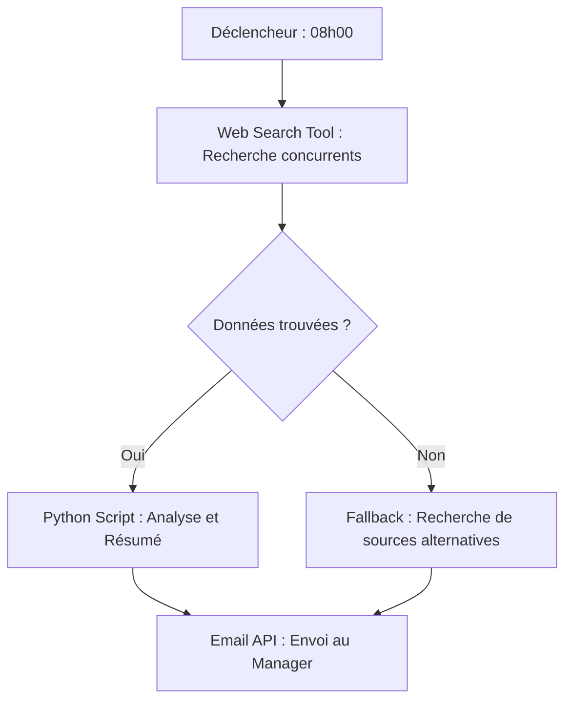

# 🤖 Flux de Travail des Agents IA : Au-delà des Chatbots

- **🎯 Public Cible :** Chefs de projet, développeurs et planificateurs souhaitant automatiser des processus métier chronophages.
- **⏱️ Temps Requis :** 30 minutes → 5 minutes
- **🤖 Modèles Recommandés :** Claude 3.5 Sonnet, GPT-4o, Gemini 3 Pro

- ⭐ **Difficulté :** ⭐⭐⭐☆☆
- ⚡️ **Efficacité :** ⭐⭐⭐⭐⭐
- 🚀 **Utilité :** ⭐⭐⭐⭐⭐

> _"Vous continuez de simplement discuter avec votre IA ? Il est temps de la laisser véritablement travailler à votre place."_

En 2026, l'Intelligence Artificielle ne se contente plus de « parler ». Elle planifie, manipule des outils logiciels et valide elle-même ses propres résultats. Ce prompt a pour but d'attribuer le rôle d'un « Agent » autonome à votre IA afin de lui déléguer la gestion et l'exécution de tâches métier complexes.

---

## ⚡️ Résumé en 3 points (TL;DR)

1. Définissez des « Rôles » et des « Outils » de manière exhaustive pour encadrer l'IA.
2. Décomposez chaque mission en étapes d'exécution séquentielles et logiques.
3. Intégrez un processus d'Autocorrection pour garantir la fiabilité des résultats générés.

---

## 🚀 Solution : "Agentic Workflow Designer"

### 🥉 Version Basique

Idéal pour mettre en place rapidement des scénarios d'automatisation simples et linéaires.

> **Rôle :** Tu es un `[Expert en Automatisation Commerciale]`.
>
> **Demande :** Conçois un flux de travail détaillé pour qu'un agent IA effectue la tâche suivante : `[Résumer les newsletters reçues par e-mail et publier une synthèse sur Slack]`.

<br>

### 🥇 Version Pro

À utiliser lorsqu'un raisonnement complexe en plusieurs étapes et l'intégration de multiples outils externes sont requis.

> **Rôle (Role) :** Tu es un `[Architecte de Systèmes IA]` et un `[Expert en Optimisation de Flux de Travail]`.
>
> **Contexte (Context) :**
>
> - Objectif principal : `[Extraire les actualités des concurrents chaque matin -> Résumer les points clés -> Générer un rapport d'analyse stratégique -> Envoyer le rapport par e-mail au Manager]`.
> - Outils disponibles : `[Outil de recherche web (Web Search Tool)]`, `[Script Python]`, `[API de messagerie (Email API)]`.
>
> **Demande (Task) :**
>
> 1. Conçois le processus de « Chaîne de Pensée (Chain of Thought) » étape par étape pour que l'agent atteigne cet objectif de manière autonome.
> 2. Spécifie clairement quel outil doit être invoqué à chaque étape.
> 3. Prévois et inclus des stratégies de repli (Fallback) pour gérer les erreurs potentielles (par exemple, si le site d'actualités est inaccessible ou bloque le scraping).
>
> **Contraintes (Constraints) :**
>
> - Minimiser autant que possible l'intervention humaine.
> - Concevoir un flux de travail performant et optimisé en tenant compte des coûts d'exécution de l'API.
>
> **Format de Sortie (Format) :**
>
> - Génère le code d'un diagramme de flux au format Mermaid illustrant le processus.
> - Fournis une explication textuelle détaillée pour chaque étape du flux.

---

## 💡 Note de l'auteur (Insight)

Le véritable secret d'un flux de travail agentique robuste réside dans la « Gestion des Erreurs (Error Handling) ». Un agent IA performant n'est pas celui qui réussit du premier coup, mais celui qui sait comment réagir face à un imprévu. Concevoir l'IA pour qu'elle puisse contourner un obstacle ou, en dernier recours, demander l'assistance d'un humain sans faire planter tout le système, c'est là que réside l'achèvement de la véritable automatisation. N'hésitez pas à demander à l'IA de lister les « Edge Cases » (cas limites) avant de finaliser votre flux !

---

## 🙋 Foire Aux Questions (FAQ)

- **Q : Dois-je savoir coder pour utiliser ce prompt ?**
  - R : Absolument pas. Ce prompt se concentre sur la phase de « conception architecturale ». Une fois le flux de travail généré, vous pouvez le mettre en œuvre concrètement en utilisant des plateformes No-Code/Low-Code comme Zapier, Make, n8n, ou en demandant à une IA de générer le code d'intégration.

- **Q : Pourquoi fournir une liste d'outils disponibles à l'IA ?**
  - R : Sans limite stricte, l'IA risque de faire des hallucinations et d'inventer des outils magiques qui n'existent pas. Définir le périmètre des outils réels (comme des scripts Python ou des API spécifiques) la force à concevoir un flux logique et applicable dans la réalité.

---

## 🧬 Anatomie du prompt (Why it works?)

1.  **Définition des Outils (Tools Definition) :** En spécifiant clairement les ressources à disposition, on réduit drastiquement les risques d'hallucinations et on ancre la réponse de l'IA dans la faisabilité technique.
2.  **Stratégie de Repli (Fallback Strategy) :** Demander explicitement de prévoir des scénarios d'échec renforce la résilience du flux de travail, simulant ainsi un comportement d'ingénierie logicielle professionnel.

---

## 📊 Preuve : Avant & Après

### ❌ Avant (Sans stratégie agentique)

```text
Résume les actualités des concurrents et envoie-les par e-mail.

Résultat : L'IA génère un texte générique ou prétend ne pas pouvoir le faire car elle ne peut pas naviguer sur le web sans instructions précises.
```

### ✅ Après (Avec le concepteur de flux de travail)



_(L'IA génère un processus structuré, résilient et immédiatement applicable)_

---

## 🎯 Conclusion

Faites de l'IA votre partenaire d'exécution, et non plus un simple assistant conversationnel. En structurant vos demandes avec des flux de travail agentiques, vous transformez des processus complexes en routines automatisées. Votre temps est précieux, réservez-le à la stratégie et laissez l'IA gérer l'opérationnel. 🛠️
