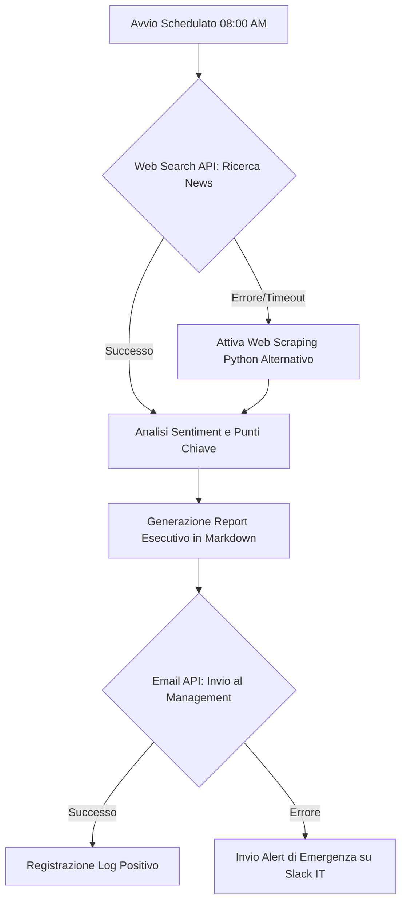

# 🤖 Flussi di Lavoro degli Agenti IA: Oltre i Chatbot

- **🎯 Pubblico:** Project manager, sviluppatori e professionisti che desiderano automatizzare compiti complessi e ripetitivi
- **⏱️ Tempo Richiesto:** Da 30 minuti → a soli 5 minuti
- **🤖 Modelli Consigliati:** Claude 3.5 Sonnet, GPT-4o, Gemini 3 Pro

- ⭐ **Difficoltà:** ⭐⭐⭐☆☆
- ⚡️ **Efficacia:** ⭐⭐⭐⭐⭐
- 🚀 **Utilità:** ⭐⭐⭐⭐⭐

> _"Stai ancora usando l'IA solo per chattare? È ora di trasformarla in un dipendente instancabile che lavora per te in background."_

Nel 2026, l'Intelligenza Artificiale ha superato la fase della semplice "conversazione". Ora pianifica, utilizza strumenti esterni e verifica autonomamente i propri risultati. Questo prompt ti permette di assegnare all'IA il ruolo di un vero e proprio "Agente", delegandole la progettazione e l'esecuzione di flussi di lavoro complessi (Agentic Workflows) in totale autonomia.

---

## ⚡️ Sintesi in 3 Punti (TL;DR)

1. **Definizione dei Ruoli e degli Strumenti:** Assegna all'IA un'identità specifica e forniscile un set di strumenti operativi ben definito.
2. **Scomposizione del Flusso:** Dividi gli obiettivi complessi in passaggi logici e sequenziali per un'esecuzione impeccabile.
3. **Autocorrezione Integrata:** Includi sempre un processo di revisione autonoma per garantire risultati affidabili e gestire gli imprevisti.

---

## 🚀 La Soluzione: "Progettista di Flussi di Lavoro Agenti"

### 🥉 Versione Base (Basic)

Ideale per impostare rapidamente scenari di automazione semplici e lineari.

> **Ruolo:** Sei un `[Esperto di Automazione Aziendale e Ottimizzazione dei Processi]`.
>
> **Richiesta:** Progetta un flusso di lavoro dettagliato per un agente IA capace di eseguire autonomamente il seguente compito: `[Riassumere le newsletter quotidiane in arrivo via email e inviare una sintesi strutturata su Slack]`.

<br>

### 🥇 Versione Pro (Professional)

Perfetta per architetture complesse che richiedono ragionamento multi-fase, utilizzo di strumenti esterni e solida gestione degli errori.

> **Ruolo (Role):** Sei un `[Architetto di Sistemi IA Senior]` e un `[Ingegnere Specializzato in Agentic Workflows]`.
>
> **Contesto (Context):**
>
> - **Obiettivo Finale:** `[Raccogliere ogni mattina le notizie sui principali competitor -> Analizzarne il sentiment e i punti chiave -> Generare un report esecutivo -> Inviare il report via email al Management Team]`
> - **Strumenti Disponibili (Tools):** `[API di Web Search]`, `[Script Python per il Web Scraping]`, `[API di invio Email]`
>
> **Richiesta (Task):**
>
> 1. Progetta un processo basato sulla "Catena di Pensiero" (Chain of Thought) affinché l'agente IA possa raggiungere l'obiettivo sopra descritto in modo logico e sequenziale.
> 2. Specifica chiaramente quale strumento (Tool) deve essere attivato in ogni singolo passaggio.
> 3. Definisci strategie di ripiego (Fallback) per gestire eventuali eccezioni o errori (ad esempio: cosa fare se il sito web di una fonte di notizie risulta inaccessibile).
>
> **Vincoli (Constraints):**
>
> - Riduci a zero la necessità di intervento umano (Human-in-the-loop solo se strettamente necessario).
> - Ottimizza il flusso di lavoro tenendo in considerazione l'efficienza computazionale e i costi delle chiamate API.
>
> **Formato di Output (Format):**
>
> - Fornisci il codice sorgente di un diagramma di flusso in formato Mermaid per visualizzare l'architettura.
> - Aggiungi una spiegazione tecnica dettagliata per le logiche operative di ogni passaggio.

---

## 💡 Commento dell'Autore (Insight)

Il vero segreto dietro un flusso di lavoro "Agentic" di successo non risiede tanto nel far eseguire un'azione all'IA, quanto nella **Gestione degli Errori (Error Handling)**.
Quando si progetta un agente, l'obiettivo è creare un sistema resiliente: l'IA non deve semplicemente bloccarsi di fronte a un ostacolo, ma deve saper aggirare il problema, provare un percorso alternativo o, come ultima opzione, generare un report per richiedere l'intervento umano. Implementare queste "vie di fuga" nel prompt trasforma un semplice script teorico in una vera automazione di livello enterprise. Personalmente, ho visto flussi di lavoro fallire decine di volte in produzione prima di capire che la strategia di fallback è persino più importante del flusso principale stesso!

---

## 🙋 Domande Frequenti (FAQ)

- **Q: È necessario saper programmare per utilizzare questo prompt?**
  - A: Assolutamente no. Questo prompt serve specificamente per la fase di "progettazione logica e architetturale". Una volta ottenuto il flusso di lavoro dall'IA, puoi implementarlo facilmente utilizzando piattaforme No-Code o Low-Code (come Zapier, Make o n8n) senza scrivere una sola riga di codice.

- **Q: Posso usare questo prompt con i modelli IA nella loro versione gratuita?**
  - A: Sebbene i modelli gratuiti possano fornire una bozza di base, i flussi di lavoro Agentic richiedono elevate capacità di ragionamento logico. Per ottenere architetture robuste, logiche di fallback avanzate e diagrammi precisi, è altamente raccomandato l'uso di modelli Premium come GPT-4o, Claude 3.5 Sonnet o Gemini 3 Pro.

---

## 🧬 Anatomia del Prompt (Why it works?)

1.  **Definizione degli Strumenti (Tools Allocation):** Dichiarando esplicitamente quali strumenti l'IA ha a disposizione (es. Web Search, Script Python), si limitano drasticamente le allucinazioni. L'IA non inventerà soluzioni magiche, ma costruirà il flusso attorno a strumenti reali e utilizzabili.
2.  **Strategia di Fallback (Resilienza):** Imporre all'IA di pensare preventivamente agli "scenari di fallimento" la costringe a progettare un sistema intrinsecamente stabile e pronto per il mondo reale.
3.  **Visualizzazione con Mermaid:** Richiedere un diagramma Mermaid permette di avere un riscontro visivo immediato della logica progettata, facilitando l'individuazione di eventuali colli di bottiglia architetturali prima ancora dell'implementazione.

---

## 📊 Dimostrazione: Prima e Dopo (Before & After)

### ❌ Before (Approccio Chatbot Classico)

```text
Prompt: Fai in modo che l'IA legga le notizie sui concorrenti e mi mandi una mail.

Risultato: L'IA si scusa dicendo di non avere accesso autonomo a internet o agli account di posta elettronica, oppure genera un riassunto totalmente inventato sul momento.
```

### ✅ After (Approccio Agentic Workflow)



_(In aggiunta, l'IA fornirà la spiegazione dettagliata e le istruzioni operative per ogni blocco del diagramma come richiesto)._

---

## 🎯 Conclusione

Non trattare più l'Intelligenza Artificiale come un semplice assistente a cui fare domande, ma come un collega operativo e strategico a cui delegare interi processi aziendali. Dedica il tuo tempo prezioso alla creatività e lascia l'esecuzione logistica agli Agenti IA.

Ora progetta il tuo primo flusso di lavoro e riprenditi il tuo tempo! 🍷
