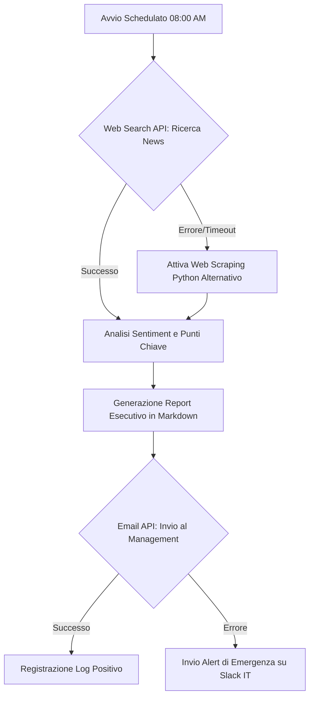

## 🤖 Flussi di Lavoro degli Agenti IA: Oltre i Chatbot

- **🎯 Pubblico:** Project manager, sviluppatori e professionisti che desiderano automatizzare compiti complessi e ripetitivi
- **⏱️ Tempo Richiesto:** Da 30 minuti → a soli 5 minuti
- **🤖 Modelli Consigliati:** Claude 3.5 Sonnet, GPT-4o, Gemini 3 Pro

- ⭐ **Difficoltà:** ⭐⭐⭐☆☆
- ⚡️ **Efficacia:** ⭐⭐⭐⭐⭐
- 🚀 **Utilità:** ⭐⭐⭐⭐⭐

> _"Stai ancora usando l'IA solo per chattare? È ora di trasformarla in un dipendente instancabile che lavora per te in background."_

Nel 2026, l'Intelligenza Artificiale ha superato la banale logica del "botta e risposta". Oggi l'IA pianifica, padroneggia strumenti esterni e valida i propri risultati senza alcun input umano. Questo prompt ti consente di elevare l'IA a un vero e proprio "Agente Operativo", delegandole l'architettura e l'esecuzione di flussi di lavoro complessi (Agentic Workflows) in totale e assoluta autonomia.

---

## ⚡️ Sintesi in 3 Punti (TL;DR)

1. **Ruoli e Strumenti Chiari:** Assegna all'IA un'identità granitica e un arsenale di strumenti operativi ben definito.
2. **Scomposizione del Flusso:** Frammenta gli obiettivi più complessi in step logici e sequenziali per garantire un'esecuzione chirurgica.
3. **Autocorrezione Integrata:** Prevedi sempre un loop di revisione autonoma per blindare i risultati e disinnescare gli imprevisti.

---

## 🚀 La Soluzione: "Progettista di Flussi di Lavoro Agenti"

### 🥉 Versione Base (Basic)

Ideale per impostare rapidamente scenari di automazione semplici e lineari.

> **Ruolo (Role):** Sei un `[Esperto di Automazione Aziendale e Ottimizzazione dei Processi]`.
>
> **Richiesta (Task):** Progetta un flusso di lavoro dettagliato per un agente IA capace di eseguire autonomamente il seguente compito: `[Riassumere le newsletter quotidiane in arrivo via email e inviare una sintesi strutturata su Slack]`.

### 🥇 Versione Pro (Professional)

Perfetta per architetture complesse che richiedono ragionamento multi-fase, utilizzo di strumenti esterni e una solida gestione degli errori.

> **Ruolo (Role):** Sei un `[Architetto di Sistemi IA Senior]` e un `[Ingegnere Specializzato in Agentic Workflows]`.
>
> **Contesto (Context):**
>
> - **Obiettivo Finale:** `[Raccogliere ogni mattina le notizie sui principali competitor -> Analizzarne il sentiment e i punti chiave -> Generare un report esecutivo -> Inviare il report via email al Management Team]`
> - **Strumenti Disponibili (Tools):** `[API di Web Search]`, `[Script Python per il Web Scraping]`, `[API di invio Email]`
>
> **Richiesta (Task):**
>
> 1. Progetta un processo basato sulla "Catena di Pensiero" (Chain of Thought) affinché l'agente IA possa raggiungere l'obiettivo descritto in modo logico e sequenziale.
> 2. Specifica in modo inequivocabile quale strumento (Tool) debba essere attivato in ogni singolo passaggio.
> 3. Definisci le strategie di ripiego (Fallback) per gestire eventuali eccezioni o errori (ad esempio: cosa fare se il sito web di una fonte risulta inaccessibile).
>
> **Vincoli (Constraints):**
>
> - Riduci a zero la necessità di intervento umano (Human-in-the-loop solo se strettamente necessario).
> - Ottimizza il flusso di lavoro tenendo in considerazione l'efficienza computazionale e i costi delle chiamate API.
>
> **Formato di Output (Format):**
>
> - Fornisci il codice sorgente di un diagramma di flusso in formato Mermaid per visualizzare l'architettura.
> - Aggiungi una spiegazione tecnica dettagliata per le logiche operative di ogni passaggio.

---

## 💡 Commento dell'Autore (Insight)

Il vero segreto dietro un flusso di lavoro "Agentic" di successo non risiede tanto nel far eseguire un'azione all'IA, quanto nella **Gestione degli Errori (Error Handling)**.
Quando si progetta un agente, l'obiettivo è creare un sistema resiliente: l'IA non deve semplicemente bloccarsi di fronte a un ostacolo, ma deve saper aggirare il problema, tentare un percorso alternativo o, come ultima ratio, generare un report per richiedere l'intervento umano. Implementare queste "vie di fuga" nel prompt trasforma un banale script teorico in una vera automazione di livello enterprise. Personalmente, ho visto flussi di lavoro fallire decine di volte in produzione prima di capire che la strategia di fallback è persino più importante del flusso principale stesso!

---

## 🙋 Domande Frequenti (FAQ)

- **Q: È necessario saper programmare per utilizzare questo prompt?**
  - A: Assolutamente no. Questo prompt serve specificamente per la fase di "progettazione logica e architetturale". Una volta ottenuto il flusso di lavoro dall'IA, puoi implementarlo con facilità utilizzando piattaforme No-Code o Low-Code (come Zapier, Make o n8n) senza scrivere una sola riga di codice.

- **Q: Posso usare questo prompt con i modelli IA nella loro versione gratuita?**
  - A: Sebbene i modelli gratuiti possano fornire una bozza di base, i flussi di lavoro Agentic richiedono capacità di ragionamento logico estremamente elevate. Per ottenere architetture robuste, logiche di fallback avanzate e diagrammi accurati, è caldamente raccomandato l'uso di modelli Premium come GPT-4o, Claude 3.5 Sonnet o Gemini 3 Pro.

---

## 🧬 Anatomia del Prompt (Why it works?)

1. **Definizione degli Strumenti (Tools Allocation):** Dichiarando esplicitamente quali strumenti l'IA ha a sua disposizione (es. Web Search, Script Python), si limitano drasticamente le allucinazioni. L'IA non inventerà soluzioni magiche, ma costruirà il flusso attorno a strumenti reali e tangibili.
2. **Strategia di Fallback (Resilienza):** Imporre all'IA di elaborare preventivamente degli "scenari di fallimento" la costringe a progettare un sistema intrinsecamente stabile e pronto per le insidie del mondo reale.
3. **Visualizzazione con Mermaid:** Richiedere un diagramma Mermaid consente di avere un riscontro visivo immediato della logica progettata, facilitando l'individuazione di eventuali colli di bottiglia architetturali prima ancora dell'implementazione.

---

## 📊 Dimostrazione: Prima e Dopo (Before & After)

### ❌ Before (Approccio Chatbot Classico)

```text
Prompt: Fai in modo che l'IA legga le notizie sui concorrenti e mi mandi una mail.

Risultato: L'IA si scusa dicendo di non avere accesso autonomo a internet o agli account di posta elettronica, oppure genera un riassunto totalmente inventato sul momento.
```

### ✅ After (Approccio Agentic Workflow)


```mermaid
graph TD;
    A[Avvio Schedulato 08:00 AM] --> B{Web Search API: Ricerca News};
    B -->|Successo| C[Analisi Sentiment e Punti Chiave];
    B -->|Errore/Timeout| D[Attiva Web Scraping Python Alternativo];
    D --> C;
    C --> E[Generazione Report Esecutivo in Markdown];
    E --> F{Email API: Invio al Management};
    F -->|Successo| G[Registrazione Log Positivo];
    F -->|Errore| H[Invio Alert di Emergenza su Slack IT];
```

_(In aggiunta, l'IA fornirà la spiegazione dettagliata e le istruzioni operative per ogni blocco del diagramma, esattamente come richiesto)._

---

## 🎯 Conclusione

Non trattare più l'Intelligenza Artificiale come un semplice assistente a cui fare domande, ma come un collega operativo e strategico a cui delegare interi processi aziendali. Dedica il tuo tempo prezioso alla creatività e lascia l'esecuzione logistica agli Agenti IA.

Ora progetta il tuo primo flusso di lavoro e riprenditi il tuo tempo! 🍷
