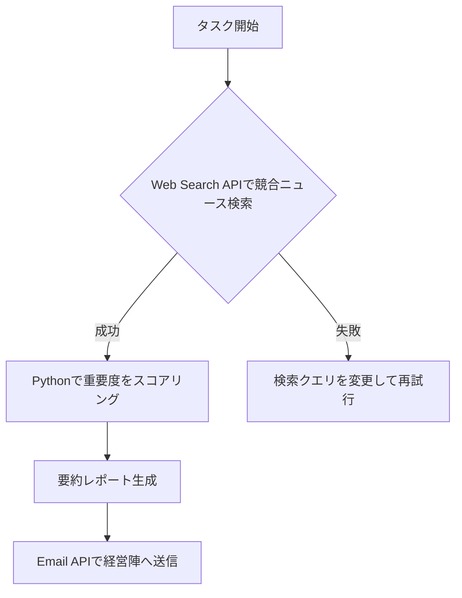

# 🤖 AIエージェントワークフロー：チャットボットを超えて行動するAIへ

- **🎯 おすすめの対象:** マーケター、企画者、反復業務を自動化したい開発者
- **⏱️ 所要時間:** 30分 → 5分に短縮
- **🤖 推奨モデル:** Claude 3.5 Sonnet, GPT-4o, Gemini 3 Pro

- ⭐ **難易度:** ⭐⭐⭐☆☆
- ⚡️ **効果:** ⭐⭐⭐⭐⭐
- 🚀 **活用度:** ⭐⭐⭐⭐⭐

> _「まだAIと『チャット』だけしていませんか？これからはAIに『仕事』を任せる時代です。」_

2026年現在、AIのトレンドは単に質問に答えるだけの「チャットボット」から、自ら計画を立て、ツールを駆使し、タスクを完遂する「AIエージェント」へと完全に移行しました。このプロンプトは、AIに複雑な業務プロセス全体を委任するための「エージェント・ワークフロー」を設計する強力なツールです。単発の指示ではなく、自律的に動くあなただけの優秀なデジタルアシスタントを構築しましょう。

---

## ⚡️ 3行要約 (TL;DR)

1. **役割とツールの明確化:** AIに具体的な「役割」と使用可能な「ツール」を定義し、行動範囲を明確にします。
2. **段階的実行 (Step-by-step):** 複雑な業務を細分化し、段階的な思考プロセス（Chain of Thought）を設計します。
3. **自己修正 (Self-Correction):** エラー発生時の代替プラン（Fallback）を組み込み、タスクの完遂率を劇的に高めます。

---

## 🚀 解決策: "Agentic Workflow Designer"

### 🥉 Basic Version (基本形)

日常のシンプルな反復業務を自動化するためのシナリオをサクッと作成したい場合に使用します。

> **役割:** あなたは`[業務自動化の専門家]`です。
> **依頼:** `[毎日の業界ニュースの要約とSlackへの自動送信]`という業務を遂行するAIエージェントのワークフローを設計してください。

 

### 🥇 Pro Version (専門家形)

複数のステップ、外部ツールの連携、そして高度な推論が求められる複雑な業務プロセスを構築する場合に使用します。

> **役割 (Role):** あなたは`[シニアAIシステムアーキテクト]`であり`[ワークフロー最適化の専門家]`です。
>
> **状況 (Context):**
>
> - 目標: `[毎朝、競合他社の最新プレスリリースをスクレイピングし、重要度を評価した上で要約レポートを作成し、経営陣にメールで送信する]`
> - 利用可能なツール: `[Web Search API]`, `[Python実行環境]`, `[Email送信API]`
>
> **依頼 (Task):**
>
> 1. 上記の目標を自律的に達成するためのエージェントの「思考の連鎖 (Chain of Thought)」プロセスを段階的に設計してください。
> 2. 各ステップでどのツールをどのように使用すべきかを具体的に明示してください。
> 3. 予期せぬエラー（例：対象サイトの仕様変更によるスクレイピング失敗など）が発生した際の対処策（Fallback戦略）を必ず含めてください。
>
> **制約事項 (Constraints):**
>
> - 人間の介入（Human-in-the-loop）は最終確認フェーズのみに最小化すること。
> - APIの呼び出し回数や実行コストを考慮した、効率的で無駄のないアーキテクチャにすること。
>
> **出力形式:**
>
> - 全体の流れが一目でわかるMermaid形式のフローチャート。
> - 各ステップの具体的かつ技術的な詳細説明。

---

## 💡 作成者コメント (Insight)

AIエージェントを実務に導入する際、最も陥りやすい罠が「Happy Path（理想的なシナリオ）」しか想定しないことです。真の自動化、つまり「Agentic Workflow」の要は**エラーハンドリング**にあります。

このプロンプトを設計する過程で、私が最もこだわったのは「Fallback（代替策）」の明記です。AIが壁にぶつかった時、そこで処理を停止するのではなく、「別の検索ワードで再試行する」「別のツールに切り替える」あるいは「人間（Human）に助けを求める」といった自律的な判断を下せるように設計することで、システムの安定性と信頼性が飛躍的に向上します。最初はBasic Versionで小さなタスクから始め、徐々にPro Versionを使って業務全体をカバーするワークフローへと拡張していくことを強くお勧めします。

---

## 🙋 よくある質問 (FAQ)

- **Q: プログラミングの知識がなくても、このワークフロー設計は役に立ちますか？**
  - A: もちろんです！このプロンプトは、自動化の「設計図」を作成するためのものです。ここで出力された設計図をもとに、Zapier、Make、Difyなどのノーコード／ローコードツールを組み合わせれば、非エンジニアでも十分に高度なAIエージェントを構築可能です。

- **Q: どのような業務がAIエージェントに向いていますか？**
  - A: 「ルールは明確だが、手順が多く面倒な作業」が最適です。例えば、CS（カスタマーサポート）の一次対応とエスカレーション判定、競合他社の価格調査とレポート生成、大量のドキュメントの分類とタグ付けなどが挙げられます。

---

## 🧬 プロンプト解剖 (Why it works?)

1.  **ツールの明確な定義 (Tools Definition):** AIが「何ができるか（そして何ができないか）」を事前に制約することで、実現不可能な計画を立てるハルシネーション（幻覚）を強力に抑制します。
2.  **自己修正メカニズム (Self-Correction):** 失敗時のシナリオ（Fallback）をプロンプト内に組み込むことで、AIに「うまくいかなかった場合のプランB」を考えさせる思考の枠組みを提供しています。

---

## 📊 証明: Before & After

### ❌ Before (一般的な指示)

> 競合のニュースをまとめてメールで送る方法を教えて。

（結果：抽象的で、具体的にどのツールをどう使えばいいか分からない一般的な回答しか得られない）

### ✅ After (プロンプト適用後の結果)

（結果：具体的なツール連携、エラー時の分岐、そして実行可能なフローチャートが生成され、すぐにシステム構築に着手できる）

---

## 🎯 結論

AIを単なる「便利な辞書」として扱う時代は終わりました。的確なワークフローを与えれば、AIはあなたの右腕となる自律的な「エージェント」に進化します。

今すぐこのプロンプトを活用して、あなたの時間を奪う単純作業をAIに任せましょう！☕️
