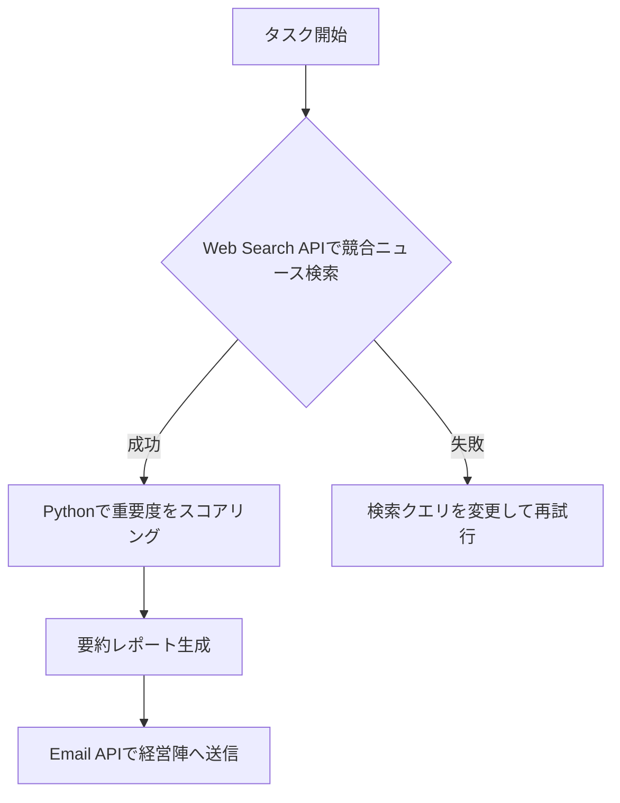

## 🤖 AIエージェントワークフロー：チャットボットを超えて行動するAIへ

- **🎯 おすすめの対象:** マーケター、企画者、反復業務を自動化したい開発者
- **⏱️ 所要時間:** 30分 → 5分に短縮
- **🤖 推奨モデル:** Claude 3.5 Sonnet, GPT-4o, Gemini 3 Pro

- ⭐ **難易度:** ⭐⭐⭐☆☆
- ⚡️ **効果:** ⭐⭐⭐⭐⭐
- 🚀 **活用度:** ⭐⭐⭐⭐⭐

> _「まだAIと単なる『チャット』で終わっていませんか？これからはAIに『実務』を完全に任せる時代です。」_

2026年の現在、AI活用のトレンドは、単に質問へ答えるだけの「チャットボット」から、自ら計画を立案し、最適なツールを駆使してタスクを最後まで完遂する「AIエージェント」へと劇的な進化を遂げています。本記事で紹介するプロンプトは、AIに対して複雑な業務プロセス全体を委任するための「エージェント・ワークフロー」を構築する極めて強力なツールです。その場しのぎの単発的な指示から脱却し、自律的に考え行動する、あなた専用の優秀なデジタルアシスタントを作り上げましょう。

---

## ⚡️ 3行要約 (TL;DR)

1. **役割とツールの厳密な定義:** AIに対して具体的な「役割」と利用可能な「ツール」を指定し、自律行動の境界線を明確にします。
2. **段階的な実行プロセスの設計:** 複雑な業務プロセスを細分化し、AIの「思考の連鎖（Chain of Thought）」を論理的に構築します。
3. **自己修復メカニズムの導入:** エラー発生時に備えた代替プラン（Fallback）を組み込むことで、業務の自動完遂率を飛躍的に向上させます。

---

## 🚀 解決策: "Agentic Workflow Designer"

### 🥉 Basic Version (基本形)

日常のシンプルな反復業務を自動化するためのシナリオをサクッと作成したい場合に使用します。

> **役割 (Role):** あなたは`[業務自動化の専門家]`です。
> 
> **依頼 (Task):** `[毎日の業界ニュースの要約とSlackへの自動送信]`という業務を遂行するAIエージェントのワークフローを設計してください。

### 🥇 Pro Version (専門家形)

複数のステップ、外部ツールの連携、そして高度な推論が求められる複雑な業務プロセスを構築する場合に使用します。

> **役割 (Role):** あなたは`[シニアAIシステムアーキテクト]`であり`[ワークフロー最適化の専門家]`です。
>
> **状況 (Context):**
>
> - 目標: `[毎朝、競合他社の最新プレスリリースをスクレイピングし、重要度を評価した上で要約レポートを作成し、経営陣にメールで送信する]`
> - 利用可能なツール: `[Web Search API]`, `[Python実行環境]`, `[Email送信API]`
>
> **依頼 (Task):**
>
> 1. 上記の目標を自律的に達成するためのエージェントの「思考の連鎖 (Chain of Thought)」プロセスを段階的に設計してください。
> 2. 各ステップでどのツールをどのように使用すべきかを具体的に明示してください。
> 3. 予期せぬエラー（例：対象サイトの仕様変更によるスクレイピング失敗など）が発生した際の対処策（Fallback戦略）を必ず含めてください。
>
> **制約事項 (Constraints):**
>
> - 人間の介入（Human-in-the-loop）は最終確認フェーズのみに最小化すること。
> - APIの呼び出し回数や実行コストを考慮した、効率的で無駄のないアーキテクチャにすること。
>
> **出力形式 (Format):**
>
> - 全体の流れが一目でわかるMermaid形式のフローチャート。
> - 各ステップの具体的かつ技術的な詳細説明。

---

## 💡 作成者コメント (Insight)

AIエージェントを実務に導入する際、多くの人が陥りがちな最大の罠は「**ハッピーパス（理想的な進行シナリオ）**」しか想定しないことです。真の業務自動化、すなわち「**Agentic Workflow（エージェント型ワークフロー）**」を成功させる鍵は、徹底した**エラーハンドリング**に他なりません。

本プロンプトの設計において、私が最も心血を注いだのが「**Fallback（代替策・回避策）**」の組み込みです。AIが予期せぬエラーの壁にぶつかった際、単に処理を停止して人間に丸投げするのではなく、「検索クエリを変更して再試行する」「代替ツールへシームレスに切り替える」、あるいは「最終手段としてのみ人間に判断を仰ぐ」といった**自律的な意思決定**を下せるよう設計しています。これにより、システムの安定性と業務の完遂信頼性が桁違いに向上します。まずはBasic Versionを用いて小さな反復タスクから着手し、成功体験を積んだ上で、Pro Versionを活用して部門全体の業務プロセスを網羅する広範なワークフローへとスケールアップしていくアプローチを強く推奨します。

---

## 🙋 よくある質問 (FAQ)

- **Q: プログラミングの知識がなくても、このワークフロー設計は役に立ちますか？**
  - A: もちろんです！このプロンプトは、自動化の「設計図」を作成するためのものです。ここで出力された設計図をもとに、Zapier、Make、Difyなどのノーコード／ローコードツールを組み合わせれば、非エンジニアであっても十分に高度なAIエージェントを構築可能です。

- **Q: どのような業務がAIエージェントに最適ですか？**
  - A: 「ルールは明確だが、手順が多くて面倒な作業」が最も適しています。例えば、CS（カスタマーサポート）の一次対応とエスカレーション判定、競合他社の価格調査とレポート生成、大量のドキュメントの分類と自動タグ付けなどが代表的です。

---

## 🧬 プロンプト解剖 (Why it works?)

1. **ツールの厳格な定義 (Tools Definition):** AIに対して「何ができるか（そして何ができないか）」を事前に制約することで、実現不可能な計画を企ててしまうハルシネーション（幻覚）を強力に抑制します。
2. **自己修復メカニズム (Self-Correction):** 失敗時のシナリオ（Fallback）をプロンプト内に組み込むことで、AIに「計画が頓挫した場合のプランB」を考案させる高度な思考の枠組みを提供しています。

---

## 📊 証明: Before & After

### ❌ Before (一般的な指示)

競合のニュースをまとめてメールで送る方法を教えて。

（結果：非常に抽象的であり、具体的にどのツールをどう連携させればよいのか分からない一般的な回答しか得られない）

### ✅ After (プロンプト適用後の結果)

```mermaid
graph TD
    A[タスク開始] --> B{Web Search APIで競合ニュース検索}
    B -->|成功| C[Pythonで重要度をスコアリング]
    B -->|失敗| D[検索クエリを変更して再試行]
    C --> E[要約レポート生成]
    E --> F[Email APIで経営陣へ送信]
```

（結果：具体的なツール連携、エラー時の条件分岐、そして即座にシステム構築へ着手できるレベルの実行可能なフローチャートが生成される）

---

## 🎯 結論

AIを単なる「便利な検索辞書」として扱う時代はすでに終わりました。的確なワークフローと権限を与えれば、AIはあなたの右腕として機能する自律的な「エージェント」へと進化します。

今すぐこのプロンプトを活用し、あなたの貴重な時間を奪う単純作業をすべてAIに委任してしまいましょう！☕️
