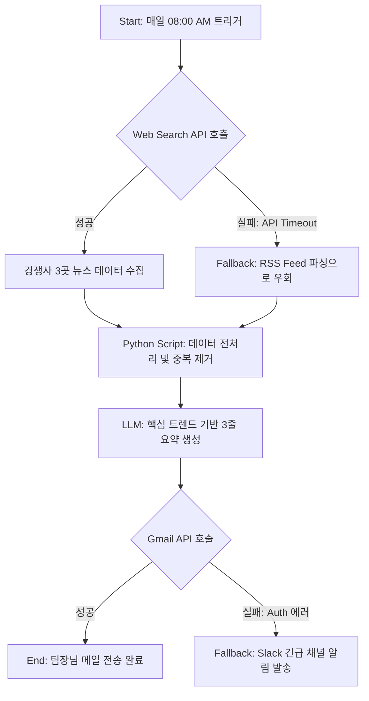

# 🤖 AI 에이전트 워크플로우: 챗봇을 넘어 행동하는 AI로

- **🎯 추천 대상:** 단순 반복 업무를 100% 자동화하고 싶은 기획자, 마케터, 개발자
- **⏱️ 소요 시간:** 30분 → 5분
- **🤖 추천 모델:** Claude 3.5 Sonnet, GPT-4o, Gemini 3 Pro

- ⭐ **난이도:** ⭐⭐⭐☆☆
- ⚡️ **효과성:** ⭐⭐⭐⭐⭐
- 🚀 **활용도:** ⭐⭐⭐⭐⭐

> _"아직도 AI와 끝없는 스무고개 채팅만 하고 계신가요? 이제 AI에게 '일'을 시킬 때입니다."_

2026년, AI의 패러다임은 '생성(Generation)'에서 '행동(Action)'으로 넘어왔습니다. 단순히 질문에 답하는 챗봇이 아니라, 스스로 계획을 세우고, 적절한 도구(API, 스크립트)를 사용하며, 결과를 검증하는 **'AI 에이전트(Agent)'**의 시대입니다.

하지만 아무리 뛰어난 AI 모델이라도 명확한 '워크플로우(Workflow)'와 '도구(Tools)'가 주어지지 않으면 헛바퀴만 돌게 됩니다. 이 프롬프트는 챗GPT나 클로드 같은 대화형 AI를 **'스스로 생각하고 행동하는 자율형 비서'**로 탈바꿈시켜주는 강력한 설계도입니다.

---

## ⚡️ 3줄 요약 (TL;DR)

1. **명확한 페르소나와 도구 부여:** AI가 스스로를 시스템 아키텍트로 인식하고 사용할 수 있는 무기(Tool)를 인지하게 합니다.
2. **생각의 사슬(Chain of Thought) 유도:** 행동하기 전 '어떻게' 문제를 해결할지 단계별로 계획을 수립하도록 강제합니다.
3. **자가 수정(Self-Correction) 메커니즘:** 실행 중 에러가 발생했을 때 멈추지 않고 스스로 우회로(Fallback)를 찾도록 설계합니다.

---

## 🚀 해결책: "Agentic Workflow Designer"

### 🥉 Basic Version (기본형)

비교적 단순한 1~2단계의 업무 자동화 시나리오의 초안을 빠르게 잡고 싶을 때 활용하세요.

> **역할:** 너는 최고 수준의 `[업무 자동화 및 AI 에이전트 전문가]`야.
>
> **요청:** 다음 목표를 달성하기 위한 AI 에이전트의 워크플로우를 단계별로 설계해줘.
>
> - 목표: `[매일 아침 9시 이메일 뉴스레터 핵심 요약 및 슬랙(Slack) 전송]`
>
> **출력:** 각 단계별 필요한 행동과 도구를 간결하게 리스트업해.

<br>

### 🥇 Pro Version (전문가형)

API 연동, 웹 스크래핑, 조건부 분기(If-Else) 등 복잡한 다단계 추론과 도구 사용이 필요한 '완전 자동화 시스템'을 기획할 때 사용하는 마스터 프롬프트입니다.

> **역할 (Role):** 너는 글로벌 IT 기업의 `[수석 AI 시스템 아키텍트]`이자 `[워크플로우 최적화 전문가]`야.
>
> **상황 (Context):**
>
> - **현재 문제:** 팀원들이 매일 수작업으로 데이터를 수집하고 보고서를 작성하느라 하루 2시간 이상을 낭비하고 있어.
> - **최종 목표:** `[매일 아침 경쟁사 3곳의 주요 뉴스 스크래핑 -> 핵심 트렌드 요약 -> 마크다운 리포트 생성 -> 팀장님 이메일 발송]`
> - **가용 도구(Tools):** `[Web Search API(Tavily 등)]`, `[Python Data Analysis Script]`, `[Gmail API]`
>
> **요청 (Task):**
>
> 1. 위 목표를 100% 자동화하기 위한 에이전트의 **'생각의 사슬(Chain of Thought)'** 과정을 단계별(Step 1, Step 2...)로 상세히 설계해.
> 2. 각 단계에서 에이전트가 정확히 **어떤 가용 도구를 호출(Call)**해야 하는지 명시해.
> 3. **예외 처리(Error Handling):** 만약 특정 단계에서 오류가 발생했을 때(예: 경쟁사 사이트 접속 차단, API Limit 초과 등) 에이전트가 취해야 할 **우회 전략(Fallback Strategy)**을 반드시 포함해.
>
> **제약사항 (Constraints):**
>
> - 사람의 개입(Human-in-the-loop)을 최소한으로 줄일 수 있는 '완전 자율형(Autonomous)' 구조여야 해.
> - 토큰 낭비와 실행 비용(Cost)을 고려하여 가장 효율적인 최단 경로로 설계해.
>
> **출력 형식 (Format):**
>
> - 시각적 이해를 돕기 위한 `Mermaid.js 플로우차트` 코드 블럭을 먼저 제시해.
> - 플로우차트 아래에 각 단계별 상세 로직을 마크다운 표가 아닌 리스트 형태로 설명해.
> - 확실하지 않은 기술적 한계나 API 스펙에 대해서는 아는 척하지 말고 추가 확인이 필요하다고 명시해 (환각 방지).

---

## 💡 작성자 코멘트 (Insight)

최근 실무에서 에이전틱 워크플로우(Agentic Workflow)를 구축하며 뼈저리게 느낀 점은 **'결국 에러 핸들링(Error Handling)이 전부'**라는 것입니다.

단순히 A→B→C 순서로 동작하는 스크립트를 짜는 것은 쉽습니다. 하지만 실전에서는 API 서버가 죽거나, 타겟 웹사이트의 DOM 구조가 바뀌는 등 수많은 변수가 발생합니다. 이 프롬프트의 핵심은 Pro Version의 `예외 처리(Error Handling)` 요구에 있습니다. AI에게 "만약 실패하면 어떻게 할래?"라는 질문을 미리 던짐으로써, 멈춰버리는 시스템이 아닌 **'스스로 복구(Self-Healing)하는 시스템'**의 밑그림을 그릴 수 있습니다. 이 프롬프트가 짜준 로직을 그대로 Zapier, Make 또는 LangChain/CrewAI에 옮기기만 해도 기획 기간을 며칠에서 단 몇 분으로 획기적으로 단축할 수 있습니다.

---

## 🙋 자주 묻는 질문 (FAQ)

- **Q: 저는 개발자가 아닌데, 이 프롬프트를 써도 소용이 있을까요?**
  - A: 오히려 기획자나 마케터분들께 더 유용합니다. 코딩을 몰라도 이 프롬프트로 도출된 논리적 흐름(Mermaid 플로우차트)을 개발자에게 전달하면, 커뮤니케이션 비용이 비약적으로 줄어듭니다. 또한 도출된 로직을 노코드 툴(Make, Zapier)에 개발 지식 없이 직접 세팅해 볼 수도 있습니다.

- **Q: 에이전트가 가용 도구(Tools)를 스스로 알아서 찾게 할 수는 없나요?**
  - A: 가능하지만 실무에서는 추천하지 않습니다. 환각(Hallucination) 현상으로 인해 존재하지 않는 가상의 API를 호출하려다 전체 프로세스가 멈출 확률이 높습니다. 사용할 수 있는 무기(도구)는 인간이 명확하게 제한(Bounding)해 주는 것이 가장 안전하고 효율적입니다.

---

## 🧬 프롬프트 해부 (Why it works?)

1.  **가용 도구(Tools)의 명시적 정의:** AI에게 권한과 한계를 동시에 부여하여, 허무맹랑한 계획이 아닌 '실제로 구현 가능한' 현실적인 아키텍처를 설계하도록 강제합니다.
2.  **의도적인 예외 상황(Fallback) 주입:** '행동하는 AI'의 가장 큰 리스크인 '실행 중단' 사태를 방지하기 위해, 플랜 B를 미리 고민하게 만드는 프롬프트 엔지니어링의 핵심 최적화 기술이 적용되었습니다.
3.  **Mermaid 시각화 강제:** 복잡한 텍스트 줄글보다 직관적인 다이어그램을 먼저 출력하게 함으로써, 전체적인 로직의 허점(Loop홀이나 병목 현상)을 인간이 한눈에 파악하고 즉각적으로 수정하기 용이해집니다.

---

## 📊 증명: Before & After

### ❌ Before (단순한 질문)

```text
[사용자 입력]
매일 아침 경쟁사 뉴스 요약해서 이메일로 보내주는 자동화 로직 좀 짜줘.

[AI의 뻔한 답변]
네, 뉴스 요약 자동화를 위해 다음 단계를 추천합니다:
1. Python으로 웹 크롤링을 합니다.
2. OpenAI API로 요약합니다.
3. SMTP로 메일을 보냅니다.
참 쉽죠?
```

### ✅ After (Agentic Workflow Designer 적용)

```text
[사용자 입력]
(Pro Version 프롬프트 전문 입력)

[AI의 전문적인 설계 결과]
```



```text
(단순 나열이 아닌, 성공/실패 분기와 우회로가 완벽하게 설계된 즉시 구현 가능한 시스템 아키텍처를 제공합니다.)
```

---

## 🎯 결론

AI를 단순히 '물어보면 대답하는 비서'로 남겨두기엔 그들의 지능이 너무나 아깝습니다. 명확한 도구를 쥐여주고, 스스로 생각할 수 있는 프로세스만 제대로 설계해 준다면 AI는 당신이 잠든 사이에도 완벽하게 업무를 처리하는 '최고의 실무자'가 될 것입니다.

지금 당장 반복되고 있는 지루한 업무 하나를 골라, 위 프롬프트로 에이전트 워크플로우를 그려보세요. 당신의 퇴근 시간이 달라집니다! 🛠️
