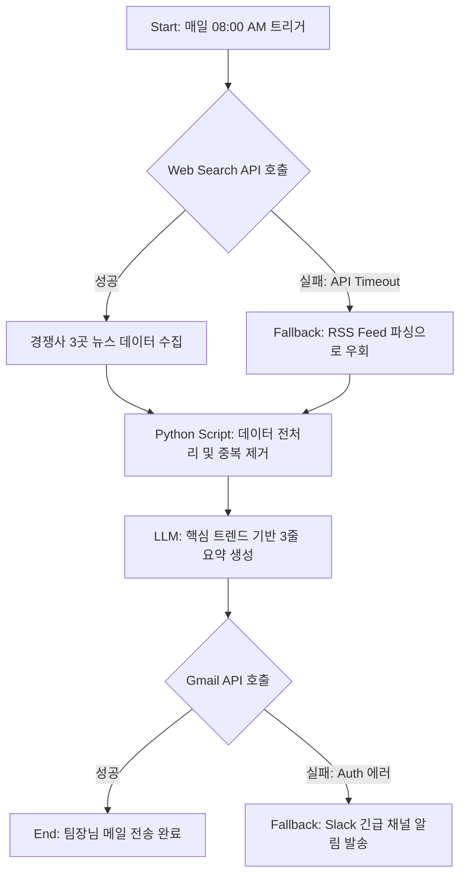

## 📝 AI 에이전트 워크플로우: 챗봇을 넘어 행동하는 AI로

- **🎯 추천 대상:** 단순 반복 업무를 100% 자동화하고 싶은 기획자, 마케터, 개발자
- **⏱️ 소요 시간:** 30분 → 5분
- **🤖 최상위 성능:** Claude 3.5 Sonnet, GPT-4o, Gemini 3 Pro

- ⭐ **난이도:** ⭐⭐⭐☆☆
- ⚡️ **효과성:** ⭐⭐⭐⭐⭐
- 🚀 **활용도:** ⭐⭐⭐⭐⭐

> _"아직도 AI와 끝없는 스무고개 채팅만 하고 계신가요? 이제 AI에게 직접 '일'을 시킬 때입니다."_

매일 아침 출근하면 가장 먼저 하는 일이 무엇인가요? 아마도 수많은 데이터와 이메일을 확인하고, 이를 정리하기 위해 ChatGPT나 Claude 창을 열어 복사하고 붙여넣는 일일 것입니다. 우리는 AI가 업무를 자동화해 줄 것이라 기대했지만, 현실은 어떤가요? **AI에게 완벽한 결과물을 얻어내기 위해 수십 번 질문을 고쳐 쓰고, 끝없는 스무고개 채팅을 반복**하고 있지 않나요? AI가 답변을 주면, 그것을 다시 엑셀에 옮기고 이메일에 첨부하여 전송하는 '진짜 노동'은 여전히 당신의 몫입니다. AI를 도입했는데 오히려 '프롬프트 입력'이라는 새로운 수작업이 추가된 셈입니다. 단순 반복 업무를 줄이려고 도입한 도구가 오히려 당신의 시간을 갉아먹는 주범이 되고 마는 이 아이러니한 상황, 익숙하지 않으신가요?

이러한 **수동적인 챗봇 의존증**은 실무자의 생산성을 심각하게 저해하는 가장 큰 병목 현상입니다. 아무리 뛰어난 AI 모델이라도 명확한 '워크플로우(Workflow)' 구조와 손에 쥐여주는 '도구(Tools)'가 없다면, 그저 말만 번지르르하게 하는 텍스트 생성기에 불과합니다. 당신이 하나부터 열까지 세세하게 지시하고, 결과를 확인한 뒤 다음 명령을 내려주지 않으면 단 한 발짝도 나아가지 못하는 나약한 어시스턴트일 뿐이죠. **결국 당신은 AI의 매니저가 되어 끊임없이 마이크로 매니징을 해야 하는 덫에 빠진 것입니다.** 진짜 비즈니스 환경에서 필요한 것은 내가 묻기 전에 스스로 계획을 세우고, 필요한 데이터를 직접 수집하며, 적절한 도구를 활용해 끝까지 임무를 완수하는 **'자율형 비서'**입니다. 지금처럼 인간이 중간에 개입해야만 시스템이 굴러가는 구조로는 진정한 의미의 자동화를 이룰 수 없습니다.

2026년, AI 생태계의 패러다임은 텍스트 '생성(Generation)'에서 실제적인 **'행동(Action)'**으로 완벽히 넘어왔습니다. 그리고 그 중심에는 스스로 판단하고 움직이는 **AI 에이전트(Agent)** 기술이 자리 잡고 있습니다. 이제 우리는 AI에게 단순한 글쓰기나 요약만을 부탁할 것이 아니라, **스스로 생각하고 완벽하게 행동하는 자율형 비서로 탈바꿈시켜주는 강력한 마스터 설계도**를 쥐여주어야 합니다. 이 지난한 고통을 단 한 번에 끊어내고 완벽한 해결책을 제시해 줄 솔루션, 바로 오늘 소개할 **"Agentic Workflow Designer" 프롬프트**입니다. 이 프롬프트는 범용 대화형 AI를 고도로 훈련된 최고 수준의 시스템 아키텍트로 변신시켜, 당신의 업무를 100% 자동화할 수 있는 치밀하고 견고한 프로세스를 스스로 설계하도록 유도합니다. 

이 프롬프트를 당신의 실무에 적용하는 순간, 당신의 역할은 단순 실무자에서 전체 시스템을 지휘하는 **시스템 오케스트레이터(Orchestrator)**로 완전히 격상됩니다. AI는 이제 당신이 지시한 최종 목표를 달성하기 위해 스스로 **어떤 외부 API를 호출할지 결정하고, 실행 중 예상치 못한 에러가 발생하면 어떻게 다른 방식으로 우회할지(Fallback)까지 플랜 B를 사전에 마련**합니다. 매일 반복되던 2시간짜리 경쟁사 리포트 스크래핑 및 요약 업무가 단 5분 만에, 그것도 당신이 다른 중요한 기획 업무에 집중하거나 커피를 마시는 동안 백그라운드에서 완벽하게 처리되는 짜릿한 경험을 하게 될 것입니다. 더 이상 챗봇의 좁은 한계에 갇혀 있지 마십시오. 이제 프롬프트 하나로 복잡한 변수들을 통제하고, 진짜 **'일'을 하는 AI 에이전트 시스템**을 당신의 손으로 직접 구축해 낼 때입니다. 업무 자동화의 차원과 격이 완전히 달라질 것입니다.

---

## 📊 증명: 통쾌한 결과물 (Before & After)

### ❌ Before (우리가 겪던 고통)

```text
> [사용자 입력]
> 매일 아침 경쟁사 뉴스 요약해서 이메일로 보내주는 자동화 로직 좀 짜줘.

> [AI의 뻔한 답변]
> 네, 뉴스 요약 자동화를 위해 다음 단계를 추천합니다:
> 1. Python으로 웹 크롤링을 합니다.
> 2. OpenAI API로 요약합니다.
> 3. SMTP로 메일을 보냅니다.
> 참 쉽죠?
```

### ✅ After (완벽하게 변신한 결과)


```mermaid
graph TD
    A[Start: 매일 08:00 AM 트리거] --> B{Web Search API 호출}
    B -->|성공| C[경쟁사 3곳 뉴스 데이터 수집]
    B -->|실패: API Timeout| D[Fallback: RSS Feed 파싱으로 우회]
    C --> E[Python Script: 데이터 전처리 및 중복 제거]
    D --> E
    E --> F[LLM: 핵심 트렌드 기반 3줄 요약 생성]
    F --> G{Gmail API 호출}
    G -->|성공| H[End: 팀장님 메일 전송 완료]
    G -->|실패: Auth 에러| I[Fallback: Slack 긴급 채널 알림 발송]
```

```text
(단순 나열이 아닌, 성공/실패 분기와 우회로가 완벽하게 설계된 즉시 구현 가능한 에이전틱 시스템 아키텍처를 제공합니다.)
```

---

## ⚡️ 3줄 요약 (TL;DR)

1. **명확한 페르소나와 무기 부여:** AI가 스스로를 시스템 아키텍트로 인식하고, 사용할 수 있는 도구(Tool)를 정확히 인지하게 만듭니다.
2. **생각의 사슬(Chain of Thought) 강제:** 무작정 행동하기 전, 문제를 '어떻게' 해결할지 단계별로 치밀한 계획을 수립하도록 유도합니다.
3. **자가 복구(Self-Correction) 메커니즘 설계:** 실행 중 예기치 못한 에러가 발생하더라도 멈추지 않고 스스로 우회로(Fallback)를 찾도록 세팅합니다.

---

## 🚀 진짜 전문가들은 이렇게 작성합니다

### 🥉 Basic Version (기본형)

비교적 단순한 1~2단계의 업무 자동화 시나리오 초안을 빠르게 기획하고 싶을 때 활용하세요.

> **역할 (Role):** 너는 최고 수준의 `[업무 자동화 및 AI 에이전트 전문가]`야.
>
> **요청 (Task):** 다음 목표를 달성하기 위한 AI 에이전트의 워크플로우를 단계별로 설계해 줘.
>
> - 목표: `[매일 아침 9시 이메일 뉴스레터 핵심 요약 및 슬랙(Slack) 전송]`
>
> **출력 형식 (Format):** 각 단계별로 필요한 행동과 도구를 간결하게 리스트업해.

### 🥇 Pro Version (전문가형)

API 연동, 웹 스크래핑, 조건부 분기(If-Else) 등 복잡한 다단계 추론과 도구 사용이 필수적인 '완전 자동화 시스템'을 기획할 때 사용하는 마스터 프롬프트입니다.

> **역할 (Role):** 너는 글로벌 IT 기업의 `[수석 AI 시스템 아키텍트]`이자 `[워크플로우 최적화 전문가]`야.
>
> **상황 (Context):**
>
> - **현재 문제:** 팀원들이 매일 수작업으로 데이터를 수집하고 보고서를 작성하느라 하루 2시간 이상을 낭비하고 있어.
> - **최종 목표:** `[매일 아침 경쟁사 3곳의 주요 뉴스 스크래핑 -> 핵심 트렌드 요약 -> 마크다운 리포트 생성 -> 팀장님 이메일 발송]`
> - **가용 도구(Tools):** `[Web Search API(Tavily 등)]`, `[Python Data Analysis Script]`, `[Gmail API]`
>
> **요청 (Task):**
>
> 1. 위 목표를 100% 자동화하기 위한 에이전트의 **'생각의 사슬(Chain of Thought)'** 과정을 단계별(Step 1, Step 2...)로 상세히 설계해.
> 2. 각 단계에서 에이전트가 정확히 **어떤 가용 도구를 호출(Call)**해야 하는지 명시해.
> 3. **예외 처리(Error Handling):** 만약 특정 단계에서 오류가 발생했을 때(예: 경쟁사 사이트 접속 차단, API Limit 초과 등) 에이전트가 취해야 할 **우회 전략(Fallback Strategy)**을 반드시 포함해.
>
> **제약사항 (Constraints):**
>
> - 사람의 개입(Human-in-the-loop)을 최소한으로 줄일 수 있는 '완전 자율형(Autonomous)' 구조여야 해.
> - 토큰 낭비와 실행 비용(Cost)을 고려하여 가장 효율적인 최단 경로로 설계해.
>
> **출력 형식 (Format):**
>
> - 시각적 이해를 돕기 위한 `Mermaid.js 플로우차트` 코드 블럭을 먼저 제시해.
> - 플로우차트 아래에 각 단계별 상세 로직을 마크다운 표가 아닌 리스트 형태로 설명해.
> - 확실하지 않은 기술적 한계나 API 스펙에 대해서는 아는 척하지 말고 추가 확인이 필요하다고 명시해 (환각 방지).

---

## 💡 작성자 코멘트 (Insight & How to use)

최근 실무에서 에이전틱 워크플로우(Agentic Workflow)를 직접 구축하며 뼈저리게 깨달은 절대적인 진리가 하나 있습니다. 바로 **'결국 에러 핸들링(Error Handling)이 전체 시스템의 명운을 가른다'**는 것입니다.

우리가 흔히 상상하는 자동화는 A를 누르면 B가 되고, 최종적으로 C가 완성되는 매끄러운 해피 패스(Happy Path)입니다. 단순히 A→B→C 순서로 동작하는 선형적인 스크립트를 짜는 것은 이제 초보자도 할 수 있을 만큼 대중화되었습니다. 하지만 실전 비즈니스 환경이라는 전쟁터에서는 우리가 통제할 수 없는 수많은 돌발 변수가 숨어 있습니다. 갑자기 API 서버가 응답을 멈추어 타임아웃이 발생하거나, 크롤링해야 할 타겟 웹사이트의 DOM(문서 객체 모델) 구조가 하루아침에 예고 없이 변경되기도 합니다. 또한, 일일 API 호출 제한(Rate Limit)에 걸려 데이터 수집이 중간에 끊기는 일도 비일비재합니다. 이런 변수 앞에서 오직 성공만을 가정하고 만들어진 얄팍한 시스템은 그 즉시 멈춰버리고, 결국 또다시 인간이 수동으로 개입해 문제를 해결해야 하는 악순환을 낳게 됩니다. 

이러한 치명적인 약점을 극복하기 위해 탄생한 이 프롬프트의 진정한 가치는 바로 Pro Version의 **`예외 처리(Error Handling)` 요구 사항**에 집중되어 있습니다. AI에게 사전에 "만약 첫 번째 시도가 실패하면 어떻게 대처할 것인가?"라는 질문을 강력하게 던짐으로써, 작은 오류에도 맥없이 멈춰버리는 나약한 봇(Bot)이 아닌 **'스스로 복구(Self-Healing)하는 견고한 시스템'**의 밑그림을 완성할 수 있는 것입니다. 예를 들어, 메인 API가 막혔을 때 에이전트가 스스로 판단하여 RSS 피드 파싱이라는 플랜 B로 즉각 우회하거나, 최종 전송 단계에서 인증 에러가 발생하면 무작정 실패로 끝내는 것이 아니라 Slack의 긴급 채널로 관리자에게 알람을 보내는 등의 똑똑한 **대체 로직(Fallback)**을 설계합니다.

그렇다면 이 프롬프트를 실무에서 200% 활용하기 위해 **변수(`[ ]`)**를 어떻게 통제해야 할까요? 핵심은 **`[가용 도구(Tools)]`** 변수를 당신이 실제로 사용할 수 있는 환경에 맞춰 구체적으로 좁혀주는 것입니다. 단순히 "웹 검색 도구"라고 적기보다는 `"Tavily API", "BeautifulSoup 파이썬 라이브러리"`처럼 명확한 기술 스택을 지정해 주어야 합니다. 에이전트에게 무한한 자유를 주면 존재하지 않는 가상의 API를 호출하려 드는 할루시네이션(환각)에 빠질 위험이 큽니다. 인간이 에이전트의 '무기'를 엄격하게 제한해 줄 때, AI는 그 한정된 자원 안에서 가장 창의적이고 현실성 있는 최단 경로를 설계해 냅니다.

이 프롬프트가 정교하게 짜준 마크다운 로직과 다이어그램을 그대로 들고 가서 **Zapier, Make와 같은 노코드(No-code) 툴이나, 최근 각광받는 LangChain, CrewAI 같은 AI 프레임워크**에 옮겨 심기만 하세요. 백지상태에서 시작할 때 며칠씩 걸리던 아키텍처 기획과 구현의 시간이 단 몇 분으로 획기적으로 압축됩니다. 시스템의 복잡도가 높아질수록 설계의 뼈대가 튼튼해야 합니다. 오늘 제공해 드린 프롬프트를 통해 더 이상 깨지지 않는, 완벽히 자율적이고 견고한 자동화 제국을 여러분의 업무 환경에 건설하시기 바랍니다. AI는 이제 명령을 기다리지 않습니다. 올바른 설계도만 있다면 알아서 행동할 뿐입니다.

---

## 🙋 자주 묻는 질문 (FAQ)

- **Q: 저는 개발자가 아닌데, 이 프롬프트를 써도 실무에 소용이 있을까요?**
  - A: 오히려 기획자나 퍼포먼스 마케터분들께 압도적으로 유용합니다. 코딩 지식이 없더라도 이 프롬프트를 통해 도출된 논리적 흐름(Mermaid 플로우차트)을 개발자에게 그대로 전달하면, 커뮤니케이션 오해와 비용이 비약적으로 줄어듭니다. 또한, 도출된 로직을 바탕으로 Make나 Zapier 같은 노코드 툴에 직접 세팅해 보는 것도 충분히 가능합니다.

- **Q: 에이전트가 자신이 쓸 수 있는 가용 도구(Tools)를 스스로 알아서 찾게 할 수는 없나요?**
  - A: 기술적으로는 가능하지만 실무 도입은 절대 추천하지 않습니다. 환각(Hallucination) 현상으로 인해 존재하지도 않는 가상의 API를 무작정 호출하려다가 전체 프로세스가 치명적으로 중단될 확률이 매우 높습니다. 에이전트가 사용할 수 있는 무기(도구)는 반드시 인간이 명확하게 제한(Bounding)해 주는 것이 가장 안전하고 비용 효율적인 방법입니다.

---

## 🧬 프롬프트 해부 (Why it works?)

1. **가용 도구(Tools)의 명시적 정의:** AI에게 권한과 한계를 명확히 동시에 부여합니다. 이를 통해 허무맹랑한 소설이 아닌, '실제로 구현 가능한' 지극히 현실적이고 단단한 아키텍처를 설계하도록 강제합니다.
2. **의도적인 예외 상황(Fallback) 주입:** '행동하는 AI'가 가진 가장 큰 리스크인 '실행 중단(Halt)' 사태를 미연에 방지하기 위해, 항상 플랜 B를 함께 고민하도록 만드는 프롬프트 엔지니어링의 핵심 최적화 기법이 적용되었습니다.
3. **Mermaid 시각화 강제:** 복잡한 텍스트 줄글보다 직관적인 다이어그램을 최우선으로 출력하게 만듭니다. 이를 통해 전체적인 로직의 치명적 허점(무한 루프나 병목 현상 등)을 인간이 한눈에 파악하고 즉각적으로 피드백하기 매우 용이해집니다.

---

## 🎯 결론

AI를 그저 '물어보면 대답이나 하는 비서' 수준으로 남겨두기엔 그들이 가진 지능과 잠재력이 너무나 아깝습니다. 명확한 도구를 손에 쥐여주고, 스스로 생각하고 판단할 수 있는 프로세스만 제대로 설계해 준다면, AI는 당신이 잠든 사이에도 완벽하게 업무를 처리해 내는 '최고의 실무 파트너'가 될 것입니다.

지금 당장 매일 반복되고 있는 지루한 업무 하나를 골라, 위 프롬프트로 에이전트 워크플로우를 직접 그려보세요. "Agentic Workflow Designer"가 여러분의 머릿속에만 있던 복잡한 자동화 아이디어를 가장 현실적이고 단단한 시스템으로 구현해 줄 것입니다. 

업무를 자동화하고 쿨하게 퇴사(또는 칼퇴)하시길 바랍니다! 🍷
