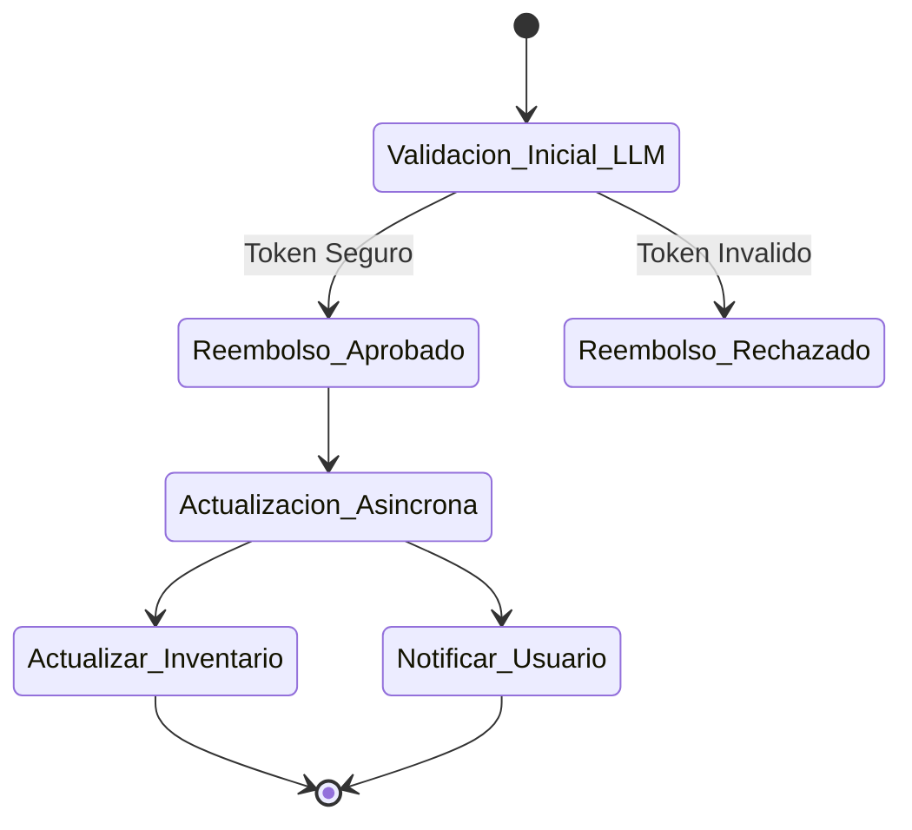

# 📝 Arquitectura de LLMs en Aplicaciones Distribuidas: Redes de Petri

- **🎯 Recomendado para:** Arquitectos de Software, Ingenieros Backend, Desarrolladores de Sistemas Distribuidos
- **⏱️ Tiempo estimado:** 2 horas → Reducido a 5 minutos
- **🤖 Modelos recomendados:** GPT-4o, Claude 3.5 Sonnet, Gemini 1.5 Pro

- ⭐ **Dificultad:** ⭐⭐⭐⭐☆
- ⚡️ **Efectividad:** ⭐⭐⭐⭐⭐
- 🚀 **Utilidad:** ⭐⭐⭐⭐⭐

> _"¿Tus agentes de IA están causando bloqueos (deadlocks) en tu arquitectura de microservicios? Es hora de domar el caos probabilístico con matemáticas comprobadas."_

La integración de Modelos de Lenguaje Grande (LLMs) en la arquitectura de software ha pasado rápidamente de ser simples chatbots a componentes centrales de sistemas complejos. Para los desarrolladores que construyen aplicaciones distribuidas, esto presenta una paradoja: los LLMs ofrecen una flexibilidad sin precedentes para manejar datos no estructurados, pero introducen comportamientos no deterministas en sistemas que exigen alta confiabilidad y consistencia. Como respuesta, combinar Redes de Petri con LLMs surge como el estándar arquitectónico para orquestar la IA con seguridad matemática.

---

## ⚡️ Resumen de 3 líneas (TL;DR)

1. Los LLMs introducen caos estocástico en los flujos de trabajo de sistemas distribuidos deterministas.
2. Las Redes de Petri proporcionan un marco matemático robusto para garantizar transiciones de estado seguras y libres de bloqueos.
3. Usa este prompt para diseñar flujos de trabajo de agentes de IA que sean resilientes, observables y tolerantes a fallos desde su concepción.

---

## 🚀 Solución: "Diseñador de Redes de Petri para LLMs"

### 🥉 Versión Básica (Basic Version)

Para estructurar rápidamente un flujo de trabajo distribuido.

> **Rol:** Eres un Arquitecto de Sistemas Distribuidos.
> **Solicitud:** Diseña una arquitectura basada en Redes de Petri para un sistema donde múltiples agentes LLM colaboran para `[insertar tarea, ej. procesar reembolsos de clientes]`. Identifica los lugares (estados) y las transiciones de forma clara.

<br>

### 🥇 Versión Pro (Pro Version)

Para una definición rigurosa y a prueba de fallos en entornos de producción.

> **Rol (Role):** Eres un Arquitecto Principal de Software especializado en sistemas distribuidos de alta disponibilidad y métodos formales (Redes de Petri).
>
> **Contexto (Context):**
>
> - Fondo: Estamos integrando múltiples agentes LLM en nuestra arquitectura de microservicios.
> - Problema: Los LLMs actúan como nodos de decisión (enrutamiento de tráfico, resolución de conflictos), pero sus salidas probabilísticas corren el riesgo de crear condiciones de carrera o bloqueos (deadlocks).
> - Objetivo: Modelar el flujo de trabajo de los agentes usando una Red de Petri para garantizar que el sistema nunca entre en un estado ilegal, manteniendo el control determinista sobre las decisiones estocásticas.
>
> **Solicitud (Task):**
>
> 1. Diseña un modelo de Red de Petri para el siguiente flujo de trabajo: `[Describir el flujo de trabajo de los agentes, ej. validación de datos, negociación entre servicios y actualización de la base de datos]`.
> 2. Define claramente los **Lugares (Places)** (estados previos/posteriores), las **Transiciones (Transitions)** (acciones de los LLMs) y los **Tokens** (datos o contexto que se mueve).
> 3. Identifica posibles cuellos de botella, bloqueos o problemas de inanición (starvation) en el modelo propuesto y sugiere estrategias técnicas para mitigarlos.
> 4. Proporciona una representación estructurada (ej. código Mermaid) de la Red de Petri generada.
>
> **Restricciones (Constraints):**
>
> - La salida debe estar rigurosamente formateada en Markdown.
> - Utiliza bloques de código Mermaid para visualizar el diagrama de estados o la Red de Petri.
> - Sé estrictamente lógico y prioriza la estabilidad del sistema sobre la complejidad del diseño.
>
> **Advertencia (Warning):**
>
> - No inventes validaciones matemáticas que no puedas respaldar. Si una transición no puede garantizar seguridad total, indícalo explícitamente para evitar fallos catastróficos.

---

## 💡 Comentario del Autor (Insight)

En sistemas distribuidos reales, dejar que un LLM tome decisiones de enrutamiento o altere el estado sin barandillas estrictas es una receta garantizada para el desastre. Al modelar las interacciones del LLM como transiciones en una Red de Petri, obligamos a la IA a operar dentro de límites matemáticamente verificables. El LLM decide _si_ una transición debe ocurrir basándose en su enorme comprensión semántica, pero la arquitectura subyacente de la red garantiza que el sistema general nunca entre en un estado corrupto. ¡Es literalmente ponerle un cinturón de seguridad de grado industrial a tus agentes de IA!

---

## 🙋 Preguntas Frecuentes (FAQ)

- **P: ¿Por qué usar Redes de Petri en lugar de simples máquinas de estado (FSM)?**
  - A: Las máquinas de estado finitos son excelentes para procesos lineales, pero las Redes de Petri brillan en sistemas concurrentes y asíncronos. Esto encaja perfectamente con la forma en que operan los microservicios modernos manejados por enjambres de agentes de IA.

- **P: ¿Cómo implemento este modelo generado en código real?**
  - A: Puedes usar la lógica estructurada generada por este prompt para configurar orquestadores de flujos de trabajo (como Temporal, AWS Step Functions o Apache Airflow), asegurando que las acciones de los LLMs sigan estrictamente las reglas de transición validadas matemáticamente.

---

## 🧬 Anatomía del Prompt (¿Por qué funciona?)

1.  **Contexto Estricto:** Define explícitamente el conflicto fundamental (comportamiento estocástico vs. sistema determinista), forzando al LLM a priorizar la ingeniería de software dura y la confiabilidad.
2.  **Formato de Salida Obligatorio (Mermaid):** Obliga al LLM a pensar de manera puramente estructural, traduciendo conceptos teóricos abstractos en diagramas renderizables y directamente verificables por humanos.
3.  **Prevención de Errores Integrada:** Al solicitar explícitamente la identificación de bloqueos (deadlocks) y condiciones de carrera, activamos el razonamiento crítico y de seguridad del modelo antes de que se escriba una sola línea de código.

---

## 📊 Demostración: Antes y Después

### ❌ Antes (Sin Redes de Petri)

```text
Agente A: "Procesé el reembolso con éxito."
Agente B: "Estoy actualizando el inventario basándome en la intención del usuario."
Sistema: *Falla silenciosamente porque ambos agentes intentaron modificar el registro de estado del usuario al mismo tiempo sin un control de concurrencia claro (Condición de Carrera fatal).*
```

### ✅ Después (Con Diseño de Redes de Petri)



_(El LLM genera un flujo robusto donde los estados concurrentes están mapeados y controlados, evitando que las operaciones asíncronas de los agentes choquen entre sí y rompan la base de datos)._

---

## 🎯 Conclusión

El futuro de los LLMs en aplicaciones distribuidas no se trata solo de integrar modelos con más parámetros y mayor ventana de contexto; se trata de construir una arquitectura de software infalible. Al combinar la flexibilidad cognitiva de la IA con la solidez absoluta de los métodos formales, construimos sistemas verdaderamente resilientes.

¡Aplica esta arquitectura a tus agentes y despídete de los fallos fantasma en producción! 🍷
