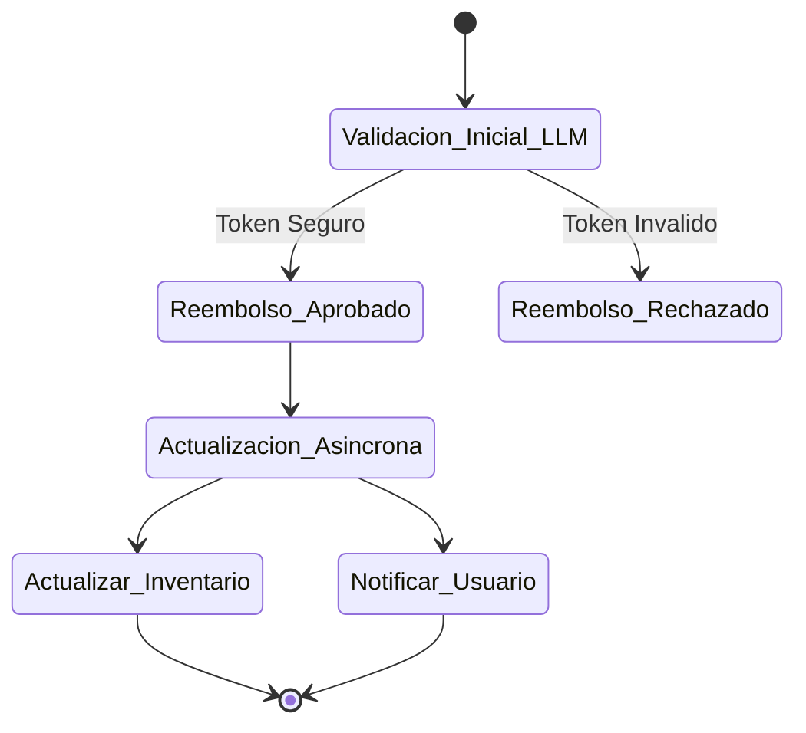

## 📝 Arquitectura de LLMs en Aplicaciones Distribuidas: Redes de Petri

- **🎯 Recomendado para:** Arquitectos de software, ingenieros de backend, desarrolladores de sistemas distribuidos
- **⏱️ Tiempo estimado:** 2 horas → Reducido a 5 minutos
- **🤖 Modelos recomendados:** GPT-4o, Claude 3.5 Sonnet, Gemini 2.5 Pro

- ⭐ **Dificultad:** ⭐⭐⭐⭐☆
- ⚡️ **Efectividad:** ⭐⭐⭐⭐⭐
- 🚀 **Utilidad:** ⭐⭐⭐⭐⭐

> _"¿Tus agentes de IA están causando bloqueos (deadlocks) en tu arquitectura de microservicios? Es hora de domar el caos probabilístico con matemáticas comprobadas."_

La integración de modelos de lenguaje grande (LLMs) en la arquitectura de software ha evolucionado rápidamente: ya no son simples chatbots, sino componentes neurálgicos de sistemas altamente complejos. Para quienes desarrollamos aplicaciones distribuidas, esto plantea una paradoja. Si bien los LLMs aportan una flexibilidad sin precedentes al procesar datos no estructurados, también inyectan un comportamiento no determinista en ecosistemas que exigen fiabilidad absoluta y consistencia estricta. Como solución definitiva, la combinación de Redes de Petri con agentes de IA se está consolidando como el estándar arquitectónico de oro para orquestar la inteligencia artificial con garantías matemáticas irrefutables.

---

## ⚡️ Resumen de 3 líneas (TL;DR)

1. Los LLMs inyectan un nivel de caos estocástico en los flujos de trabajo de los sistemas distribuidos que, por naturaleza, requieren determinismo.
2. Las Redes de Petri brindan el marco matemático definitivo para asegurar transiciones de estado a prueba de fallos y libres de bloqueos (*deadlocks*).
3. Utiliza este prompt para diseñar flujos de trabajo de agentes de IA que nazcan siendo resilientes, altamente observables y tolerantes a fallos.

---

## 🚀 Solución: "Diseñador de Redes de Petri para LLMs"

### 🥉 Versión Básica (Basic Version)

Para estructurar rápidamente un flujo de trabajo distribuido.

> **Rol (Role):** Eres un Arquitecto de Sistemas Distribuidos.
>
> **Solicitud (Task):** Diseña una arquitectura fundamentada en Redes de Petri para un sistema en el que múltiples agentes LLM colaboran para `[inserta la tarea, ej. procesar reembolsos de clientes]`. Identifica con absoluta claridad los lugares (estados) y las transiciones.

### 🥇 Versión Pro (Pro Version)

Para una definición rigurosa y a prueba de fallos en entornos de producción.

> **Rol (Role):** Eres un Arquitecto Principal de Software especializado en sistemas distribuidos de alta disponibilidad y métodos formales (Redes de Petri).
>
> **Contexto (Context):**
>
> - Fondo: Estamos integrando múltiples agentes LLM en nuestra arquitectura de microservicios.
> - Problema: Los LLMs actúan como nodos de decisión (enrutamiento de tráfico, resolución de conflictos), pero sus salidas probabilísticas corren el riesgo de crear condiciones de carrera o bloqueos (*deadlocks*).
> - Objetivo: Modelar el flujo de trabajo de los agentes usando una Red de Petri para garantizar que el sistema nunca entre en un estado ilegal, manteniendo el control determinista sobre las decisiones estocásticas.
>
> **Solicitud (Task):**
>
> 1. Diseña un modelo de Red de Petri para el siguiente flujo de trabajo: `[Describe el flujo de trabajo de los agentes, ej. validación de datos, negociación entre servicios y actualización de la base de datos]`.
> 2. Define claramente los **Lugares (Places)** (estados previos/posteriores), las **Transiciones (Transitions)** (acciones de los LLMs) y los **Tokens** (datos o contexto que se transfiere).
> 3. Identifica posibles cuellos de botella, bloqueos o problemas de inanición (*starvation*) en el modelo propuesto y sugiere estrategias técnicas concretas para mitigarlos.
> 4. Proporciona una representación estructurada (ej. código Mermaid) de la Red de Petri generada.
>
> **Restricciones (Constraints):**
>
> - La salida debe estar rigurosamente formateada en Markdown.
> - Utiliza bloques de código Mermaid para visualizar el diagrama de estados o la Red de Petri.
> - Sé estrictamente lógico y prioriza la estabilidad del sistema por encima de la complejidad del diseño.
>
> **Advertencia (Warning):**
>
> - No inventes validaciones matemáticas que no puedas respaldar con certeza. Si una transición no puede garantizar la seguridad total, indícalo de forma explícita para evitar fallos catastróficos.

---

## 💡 Comentario del Autor (Insight)

En los ecosistemas distribuidos del mundo real, permitir que un LLM tome decisiones de enrutamiento o altere el estado global sin **barreras de contención estrictas** es una receta infalible para el desastre. Al modelar cada interacción de los agentes LLM como transiciones dentro de una Red de Petri, forzamos a la inteligencia artificial a operar dentro de límites que son matemáticamente verificables. El LLM es quien decide *si* una transición debe ejecutarse aprovechando su vasto razonamiento semántico, pero es la arquitectura subyacente de la red la que asegura que el sistema en su totalidad jamás caiga en un estado corrupto o inconsistente. ¡Se trata, literalmente, de abrocharle un cinturón de seguridad de grado industrial a tus agentes de IA!

---

## 🙋 Preguntas Frecuentes (FAQ)

- **P: ¿Por qué debería utilizar Redes de Petri en lugar de máquinas de estados finitos (FSM) convencionales?**
  - R: Mientras que las máquinas de estados finitos son excepcionales para modelar procesos estrictamente lineales, las Redes de Petri despliegan todo su potencial en entornos concurrentes y asíncronos. Esta capacidad de manejar la concurrencia encaja a la perfección con la naturaleza de los microservicios modernos orquestados por enjambres de agentes de IA.

- **P: ¿Cómo puedo traducir el modelo conceptual generado a código real en producción?**
  - R: La lógica estructurada que obtienes de este prompt es ideal para configurar motores de orquestación de flujos de trabajo robustos (como Temporal, AWS Step Functions o Apache Airflow). Esto garantiza que las acciones ejecutadas por los LLMs obedezcan estrictamente a reglas de transición que ya han sido validadas matemáticamente.

---

## 🧬 Anatomía del Prompt (¿Por qué funciona?)

1. **Contexto Estricto:** Define explícitamente el conflicto fundamental (comportamiento estocástico vs. sistema determinista), forzando al LLM a priorizar la ingeniería de software dura y la confiabilidad.
2. **Formato de Salida Obligatorio (Mermaid):** Obliga al LLM a pensar de manera puramente estructural, traduciendo conceptos teóricos abstractos en diagramas renderizables y directamente verificables por humanos.
3. **Prevención de Errores Integrada:** Al solicitar explícitamente la identificación de bloqueos (*deadlocks*) y condiciones de carrera, activamos el razonamiento crítico y de seguridad del modelo antes de que se escriba una sola línea de código.

---

## 📊 Demostración: Antes y Después

### ❌ Antes (Sin Redes de Petri)

```text
Agente A: "Procesé el reembolso con éxito."
Agente B: "Estoy actualizando el inventario basándome en la intención del usuario."
Sistema: *Falla silenciosamente porque ambos agentes intentaron modificar el registro de estado del usuario al mismo tiempo sin un control de concurrencia claro (Condición de Carrera fatal).*
```

### ✅ Después (Con Diseño de Redes de Petri)


```mermaid
stateDiagram-v2
    [*] --> Validacion_Inicial_LLM
    Validacion_Inicial_LLM --> Reembolso_Aprobado: Token Seguro
    Validacion_Inicial_LLM --> Reembolso_Rechazado: Token Invalido
    Reembolso_Aprobado --> Actualizacion_Asincrona
    Actualizacion_Asincrona --> Actualizar_Inventario
    Actualizacion_Asincrona --> Notificar_Usuario
    Actualizar_Inventario --> [*]
    Notificar_Usuario --> [*]
```

_(El LLM diseña un flujo de ejecución impecable donde todos los estados concurrentes quedan rigurosamente mapeados y controlados. Esto previene que las operaciones asíncronas de los agentes colisionen entre sí y corrompan la integridad de la base de datos)._

---

## 🎯 Conclusión

El futuro de los LLMs dentro de las aplicaciones distribuidas no consiste únicamente en adoptar modelos con más parámetros o ventanas de contexto infinitas; el verdadero reto es forjar una arquitectura de software verdaderamente infalible. Al fusionar la inigualable flexibilidad cognitiva de la inteligencia artificial con la rigidez absoluta de los métodos formales, logramos construir sistemas extraordinariamente resilientes.

¡Implementa esta arquitectura en tus flujos de agentes y dile adiós para siempre a los fallos fantasma en producción! 🍷
